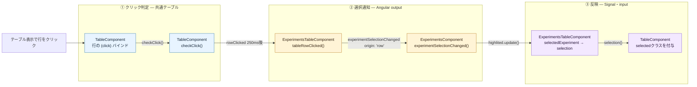

# Bulletin解析: 実験管理画面で行をクリックしてハイライトを切り替える

## 30秒で分かる結論

テーブル表示で行をクリックすると、共通テーブルがシングルクリックかどうかを判定し、outputを2段中継して、画面Componentの `highlited` Signalを切り替える。

| 担当 | 技術 | 実際の役割 |
|---|---|---|
| クリック判定 | `(click)` + `setTimeout` | 250ms待ち、ダブルクリックでなければ `rowClicked` を通知する |
| 選択通知 | Angular `output()` | 共通テーブル → 実験テーブル → 実験管理画面へ、クリックされた実験を `origin: 'row'` 付きで中継する |
| ハイライト状態 | Angular Signal | 同じ行なら解除、別の行ならその実験へ `highlited` を書き換える。NgRx Storeは更新しない |
| 表示 | `input()` + `[class.selected]` | ハイライト対象の行に `selected` クラスを付ける |

> **行クリックはStoreへdispatchせず、画面ComponentのSignalを切り替えるだけである。**

## 全体図



## コードを追う6地点

### 1. 行のクリックを `checkClick()` へ渡す

`<tr>` の `(click)` が、クリックイベントと行データを `checkClick({e: $event, data: rowData})` へ渡す。条件 `!minimizedView() &&` により、この経路はテーブル表示のときだけ動く。

- [`(click)` バインド](./src/app/webapp-common/shared/ui-components/data/table/table.component.html#L138)

### 2. 250ms待ってシングルクリックとして通知

`TableComponent.checkClick()` はすぐには通知しない。`window.setTimeout` で250ms待ち、その間に2回目のクリックがなければ `rowClicked.emit(param)` を実行する。実験テーブルは `(rowClicked)="tableRowClicked($event)"` で受け取る。

- [`TableComponent.checkClick()`](./src/app/webapp-common/shared/ui-components/data/table/table.component.ts#L566)
- [`rowClicked.emit(param)`](./src/app/webapp-common/shared/ui-components/data/table/table.component.ts#L573)
- [`rowClicked` の受信](./src/app/webapp-common/experiments/dumb/experiments-table/experiments-table.component.html#L28)

### 3. クリックされた実験を親へ通知

`ExperimentsTableComponent.tableRowClicked()` は、`selectionMode()` が `'single'` のとき `experimentSelectionChanged.emit({experiment: data, origin: 'row'})` を実行する。実験管理画面は `selectionMode="single"` を渡している。親は `(experimentSelectionChanged)="getTableModeFromURL() !== 'compare' && experimentSelectionChanged($event)"` で受け取る。

- [`ExperimentsTableComponent.tableRowClicked()`](./src/app/webapp-common/experiments/dumb/experiments-table/experiments-table.component.ts#L336)
- [`experimentSelectionChanged.emit({..., origin: 'row'})`](./src/app/webapp-common/experiments/dumb/experiments-table/experiments-table.component.ts#L338)
- [`experimentSelectionChanged` の受信](./src/app/webapp-common/experiments/experiments.component.html#L101)

### 4. ハイライト対象を切り替える

`ExperimentsComponent.experimentSelectionChanged()` は、`minimizedView()` がfalseで `openInfo` もないため、`origin === 'row'` の分岐へ進む。`selectionState().highlited.update()` で、現在と同じ実験ならnull、別の実験ならその実験へ書き換える。ここでは `store.dispatch()` を呼ばない。

- [`ExperimentsComponent.experimentSelectionChanged()`](./src/app/webapp-common/experiments/experiments.component.ts#L542)
- [`highlited.update()`](./src/app/webapp-common/experiments/experiments.component.ts#L554)

### 5. ハイライト対象をテーブルへ渡す

`highlited` は `selectionState().highlited()` を読む `computed` なので、`update()` の後に再評価される。その値は `[selectedExperiment]="highlited()"` で実験テーブルへ、さらに `[selection]="selectedExperiment()"` で共通テーブルへ渡る。

- [`highlited` computed](./src/app/webapp-common/experiments/experiments.component.ts#L236)
- [`[selectedExperiment]="highlited()"`](./src/app/webapp-common/experiments/experiments.component.html#L91)
- [`[selection]="selectedExperiment()"`](./src/app/webapp-common/experiments/dumb/experiments-table/experiments-table.component.html#L17)

```text
selectionState().highlited Signal
        ↓
highlited computed（compare表示ならnull）
        ↓
ExperimentsTableComponent.selectedExperiment input
        ↓
TableComponent.selection input
```

### 6. 行に `selected` クラスを付ける

`<tr>` の `[class.selected]="isSelected(rowData)"` が、`selection()` と行データの `id` を比較する。一致した行に `selected` クラスが付き、SCSSの `&.selected` で背景色 `--row-selected-color` が適用される。

- [`[class.selected]`](./src/app/webapp-common/shared/ui-components/data/table/table.component.html#L135)
- [`TableComponent.isSelected()`](./src/app/webapp-common/shared/ui-components/data/table/table.component.ts#L625)
- [`&.selected` のスタイル](./src/app/webapp-common/shared/ui-components/data/table/table.component.scss#L190)

## 表示状態とクリック方法による分岐

分岐はStep 1〜4で起きる。ハイライトを切り替えるのは、テーブル表示でのシングルクリックだけである。

```text
テーブル表示でシングルクリック
  → highlited を切り替える（本線）

テーブル表示でチェック済みの行をシングルクリック
  → highlited を切り替えた後、openContextMenu() でコンテキストメニューも開く

テーブル表示でダブルクリック
  → rowDoubleClicked → openInfo: true → experimentSelectionChanged Actionをdispatch

詳細パネル表示中（URLに実験IDがあり minimizedView() が true）に別の実験をクリック
  → (click) は動かない
  → pSelectableRow の onRowSelect → origin: 'table' → experimentSelectionChanged Actionをdispatch
```

テーブル表示でも `pSelectableRow` による `onRowSelect` / `onRowUnselect` は発火し、`origin: 'table'` で親まで届く。ただし `minimizedView()` がfalse、`openInfo` なし、`origin !== 'row'` のため、`experimentSelectionChanged()` 内では何も起きない。

該当処理:

- [`checkClick():566-576`](./src/app/webapp-common/shared/ui-components/data/table/table.component.ts#L566)
- [`tableRowClicked():336-343`](./src/app/webapp-common/experiments/dumb/experiments-table/experiments-table.component.ts#L336)
- [`experimentSelectionChanged():542-557`](./src/app/webapp-common/experiments/experiments.component.ts#L542)

## 補足: `highlited` はStoreの選択実験を初期値にしたローカルSignalである

`selectionState` は `computed` の中で `signal` を生成している。Storeから取った `selectedTableExperiment` が変わるたびに、`selectedTableExperiment() ?? previousTableExperiment()` を初期値とする `highlited` が作り直される。行クリックは、その `signal` を `update()` で書き換えるだけである。

[`selectedTableExperiment`](./src/app/webapp-common/experiments/experiments.component.ts#L229)
→ [`selectionState` computed](./src/app/webapp-common/experiments/experiments.component.ts#L232)
→ [`highlited.update()`](./src/app/webapp-common/experiments/experiments.component.ts#L554)

## Bulletin解析到達点

テーブル表示で行をクリックしてから、`highlited` Signalが切り替わり、対象行に `selected` クラスが付くまでを確認した。

ハイライト変更後に実験テーブルが呼ぶ `focusSelected()`、ダブルクリックや詳細パネル表示中にdispatchされる `experimentSelectionChanged` Action以降の処理は、このBulletin解析の対象外とする。
