# Bulletin解析: アプリを起動してヘッダーを表示する

## 30秒で分かる結論

ヘッダーは、ルート `''` に割り当てられた外枠 `AppComponent` のテンプレートに直接置かれている。表示条件はStoreの `currentUser` があることだけで、その値はルートComponentが生成される前のアプリ初期化処理で取得済みになる。

| 担当 | 技術 | 実際の役割 |
|---|---|---|
| 起動の待ち合わせ | Angular `provideAppInitializer` | ユーザー取得が終わるまで、ルートComponentの生成を待たせる |
| ユーザー取得 | NgRx Action・Effect・Reducer | `fetchCurrentUser` で `users.get_current_user` を呼び、`currentUser` をStoreへ保存する |
| 外枠の描画 | Angular Router | `<sm-root>` の `<router-outlet />` に、ルート `''` の `AppComponent` を描画する |
| 表示判定 | `selectSignal` + `@if` | `currentUser()` があるときだけ `<sm-header>` を描画する |

> **ヘッダーはページのルート定義に含まれず、外枠の `AppComponent` がStoreの `currentUser` だけを見て出し分けている。**

## 全体図

```mermaid
---
config:
  flowchart:
    nodeSpacing: 214
---
flowchart LR
    User["ブラウザでアプリを開く"]

    subgraph Boot["① 起動 — Angular bootstrap"]
        Main["main.ts<br>bootstrapApplication()"]
        Init["app-init.ts<br>loadUserAndPreferences()"]
    end

    subgraph Fetch["② ユーザー取得 — NgRx"]
        Login["BaseLoginService<br>loginFlow()"]
        Effect["UserEffects<br>fetchUser$"]
        Reducer["usersReducer<br>currentUserを保存"]
    end

    subgraph Render["③ 描画 — Router・Template"]
        Root["AppRootComponent<br>router-outletへAppComponentを描画"]
        Shell["AppComponent<br>@if currentUser() でsm-headerを描画"]
    end

    User --> Main
    Main -->|"provideAppInitializer()"| Init
    Init -->|"loginFlow()"| Login
    Login -->|"fetchCurrentUser"| Effect
    Effect -->|"setCurrentUser"| Reducer
    Reducer -->|"userInitialized: true → Promise resolve"| Root
    Root -->|"path: '' → AppComponent"| Shell

    classDef boot fill:#e8f4ff,stroke:#2774ae,color:#123;
    classDef ngrx fill:#fff4d6,stroke:#b7791f,color:#321;
    classDef template fill:#f3e8ff,stroke:#805ad5,color:#213;
    class Main,Init boot;
    class Login,Effect,Reducer ngrx;
    class Root,Shell template;
```



## コードを追う7地点

### 1. 起動設定を渡してブートストラップする

`main.ts` が `fetchConfigOutSideAngular()` の後に `bootstrapApplication(AppRootComponent, getAppConfig(...))` を実行する。`getAppConfig()` の providers には、ルーティング定義を登録する `provideRouter(routes)` と、次の地点の `provideAppInitializer()` が含まれる。

- [`bootstrapApplication()`](./src/main.ts#L44)
- [`provideRouter(routes)`](./src/app/app.config.ts#L38)

### 2. 初期化処理でユーザー読み込みの完了を待つ

`provideAppInitializer()` は `loadUserAndPreferences()` のPromiseを返す。Angularは、このPromiseがresolveされるまでルートComponentを生成しない。`loadUserAndPreferences()` は `initConfigurationService()` と `initCredentials()` を終えた後、`switchMap(() => loginService.loginFlow())` へ進む。

- [`provideAppInitializer()`](./src/app/app.config.ts#L78)
- [`loadUserAndPreferences()`](./src/app/core/app-init.ts#L7)
- [`switchMap(() => loginService.loginFlow())`](./src/app/core/app-init.ts#L17)

### 3. 認証済みなら現在ユーザーの取得をdispatchする

`BaseLoginService.loginFlow()` は、`authenticated` が `false` でなければ `store.dispatch(fetchCurrentUser())` を実行する。`authenticated` は、Step 2の `initCredentials()` 内で `loginSupportedModes()` の応答から設定済みである。dispatch後は、`loadPreferences()` と「`selectUserInitialized` が `true` になるまでの待機」を `combineLatest` で束ねて返す。

- [`BaseLoginService.loginFlow()`](./src/app/webapp-common/shared/services/login.service.ts#L230)
- [`dispatch(fetchCurrentUser())`](./src/app/webapp-common/shared/services/login.service.ts#L260)
- [`selectUserInitialized` の待機](./src/app/webapp-common/shared/services/login.service.ts#L263)

### 4. Effectが現在ユーザーをAPIから取得する

`UserEffects.fetchUser$` が `ofType(fetchCurrentUser)` で受け取り、`usersGetCurrentUser()` で `users.get_current_user` を呼ぶ。応答後は `userPreferences.isReady$` が `true` になるのを待ち、`setCurrentUser({user: res.user, ...})` と `fetchCurrentUserCompleted()` を順にdispatchする。`isReady$` は、Step 3で並行して呼ばれた `loadPreferences()` が `true` にする。

- [`UserEffects.fetchUser$`](./src/app/core/effects/users.effects.ts#L52)
- [`usersGetCurrentUser()`](./src/app/core/effects/users.effects.ts#L54)
- [`setCurrentUser()` のdispatch](./src/app/core/effects/users.effects.ts#L61)

### 5. `currentUser` をStoreへ保存し、初期化を完了する

`usersReducer` の `on(setCurrentUser)` が `currentUser: action.user` を設定する。続く `fetchCurrentUserCompleted` で `userInitialized` が `true` になり、Step 3の待機が解ける。`loginFlow()` が完了すると、Step 2の `finalize(() => resolve(null))` がPromiseをresolveする。

- [`on(setCurrentUser)`](./src/app/core/reducers/users.reducer.ts#L12)
- [`on(fetchCurrentUserCompleted)`](./src/app/webapp-common/core/reducers/users-reducer.ts#L91)
- [`finalize(() => resolve(null))`](./src/app/core/app-init.ts#L18)

```text
users.get_current_user の応答 res.user
        ↓
setCurrentUser({user})
        ↓
Store users.currentUser
        ↓
selectCurrentUser
```

### 6. ルート `''` の `AppComponent` を描画する

初期化が完了すると、Angularは `index.html` の `<sm-root>` に `AppRootComponent` を生成する。そのテンプレートは `<router-outlet />` だけである。Routerの初回ナビゲーションで、`/login` などの兄弟ルートを除くURLは `path: '', component: AppComponent` の子ルートに一致し、`AppComponent` がこの `<router-outlet />` に描画される。

- [`<sm-root>`](./src/index.html#L19)
- [`<router-outlet />`](./src/app/app.ts#L7)
- [`path: '', component: AppComponent`](./src/app/app.routes.ts#L31)

### 7. `currentUser()` があれば `<sm-header>` を描画する

`AppComponent` は `store.selectSignal(selectCurrentUser)` で `currentUser` Signalを持つ。テンプレートの `@if (currentUser())` がtrueのとき `<sm-header>` が描画され、selector `sm-header` の `HeaderComponent` が生成される。`<sm-header>` は、ページ本体を描画する `<router-outlet class="main-router">` の兄弟要素として置かれている。認証済みで `users.get_current_user` が成功していれば、Step 5で `currentUser` が設定済みなので、最初の描画からヘッダーが表示される。

- [`currentUser = store.selectSignal(selectCurrentUser)`](./src/app/app.component.ts#L71)
- [`<sm-header>`](./src/app/app.component.html#L16)
- [`HeaderComponent` の selector](./src/app/webapp-common/layout/header/header.component.ts#L35)

## 認証状態による分岐

分岐はStep 3で起きる。未認証ではユーザーを取得せず、Step 6で `AppComponent` ではなくログイン画面が描画される。

```text
認証済み（authenticated が false でない）
  → fetchCurrentUser → currentUser を設定 → <sm-header> を描画（本線）

未認証（authenticated === false）
  → loginFlow() が /login 系のURLを返す
  → loadUserAndPreferences() が replaceState でURLを書き換える
  → Routerは AppComponent の外にある path: 'login' へ進む
  → AppComponent を描画しないため、ヘッダーも描画されない

ログイン画面でログインに成功
  → LoginComponent.afterLogin() が fetchCurrentUser をdispatchし、getNavigateUrl() のURLへ遷移
  → Step 4〜5と同じ経路で currentUser が設定され、遷移先の AppComponent で @if がtrueになる
```

該当処理:

- [`loginFlow():257-258`](./src/app/webapp-common/shared/services/login.service.ts#L257)
- [`routes:176-178`](./src/app/app.routes.ts#L176)
- [`LoginComponent.afterLogin():250-262`](./src/app/webapp-common/login/login/login.component.ts#L250)

## 補足: ユーザー取得のEffectとReducerはルートのStoreに登録済みである

`fetchCurrentUser` がStep 4の `UserEffects` に届き、`setCurrentUser` がStep 5の `usersReducer` に届くのは、どちらも `coreProviders` でルートのStoreに登録されているためである。`provideEffects()` は環境初期化時にEffectを起動するので、その後に実行される初期化処理からのdispatchも受け取れる。

[`coreProviders`](./src/app/app.config.ts#L43)
→ [`provideStore(reducers)`](./src/app/core/core.providers.ts#L21)
→ [`users: usersReducer`](./src/app/core/core.config.ts#L29)

[`coreProviders`](./src/app/app.config.ts#L43)
→ [`UserEffects` の登録](./src/app/core/core.providers.ts#L36)

## Bulletin解析到達点

ブラウザでアプリを開いてから、`AppComponent` が `currentUser` を確認して `<sm-header>`（`HeaderComponent`）を描画するまでを確認した。

`HeaderComponent` 内部の描画（パンくず、ナビゲーションタブ、ユーザーメニュー）、同じ `currentUser()` 条件で描画される `<sm-side-nav>`、`currentUser` 設定後に `AppComponent` のコンストラクタが行う購読処理は、このBulletin解析の対象外とする。

## コード注記一覧

- `[ngbi:02-01]` [`bootstrapApplication()`](./src/main.ts#L44)
- `[ngbi:02-02]` [`provideRouter(routes)`](./src/app/app.config.ts#L38)
- `[ngbi:02-03]` [`provideAppInitializer()`](./src/app/app.config.ts#L78)
- `[ngbi:02-04]` [`loadUserAndPreferences()`](./src/app/core/app-init.ts#L7)
- `[ngbi:02-05]` [`switchMap(() => loginService.loginFlow())`](./src/app/core/app-init.ts#L17)
- `[ngbi:02-06]` [`BaseLoginService.loginFlow()`](./src/app/webapp-common/shared/services/login.service.ts#L230)
- `[ngbi:02-07]` [`dispatch(fetchCurrentUser())`](./src/app/webapp-common/shared/services/login.service.ts#L260)
- `[ngbi:02-08]` [`selectUserInitialized` の待機](./src/app/webapp-common/shared/services/login.service.ts#L263)
- `[ngbi:02-09]` [`UserEffects.fetchUser$`](./src/app/core/effects/users.effects.ts#L52)
- `[ngbi:02-10]` [`usersGetCurrentUser()`](./src/app/core/effects/users.effects.ts#L54)
- `[ngbi:02-11]` [`setCurrentUser()` のdispatch](./src/app/core/effects/users.effects.ts#L61)
- `[ngbi:02-12]` [`on(setCurrentUser)`](./src/app/core/reducers/users.reducer.ts#L12)
- `[ngbi:02-13]` [`on(fetchCurrentUserCompleted)`](./src/app/webapp-common/core/reducers/users-reducer.ts#L91)
- `[ngbi:02-14]` [`finalize(() => resolve(null))`](./src/app/core/app-init.ts#L18)
- `[ngbi:02-15]` [`<sm-root>`](./src/index.html#L19)
- 注記なし [`<router-outlet />`](./src/app/app.ts#L7) — 複数行のテンプレートリテラルの途中のため
- `[ngbi:02-16]` [`path: '', component: AppComponent`](./src/app/app.routes.ts#L31)
- `[ngbi:02-17]` [`currentUser = store.selectSignal(selectCurrentUser)`](./src/app/app.component.ts#L71)
- `[ngbi:02-18]` [`<sm-header>`](./src/app/app.component.html#L16)
- `[ngbi:02-19]` [`HeaderComponent` の selector](./src/app/webapp-common/layout/header/header.component.ts#L35)
- `[ngbi:02-20]` [`loginFlow():257-258`](./src/app/webapp-common/shared/services/login.service.ts#L257)
- `[ngbi:02-21]` [`routes:176-178`](./src/app/app.routes.ts#L176)
- `[ngbi:02-22]` [`LoginComponent.afterLogin():250-262`](./src/app/webapp-common/login/login/login.component.ts#L250)
- `[ngbi:02-23]` [`coreProviders`](./src/app/app.config.ts#L43)
- `[ngbi:02-24]` [`provideStore(reducers)`](./src/app/core/core.providers.ts#L21)
- `[ngbi:02-25]` [`users: usersReducer`](./src/app/core/core.config.ts#L29)
- `[ngbi:02-26]` [`UserEffects` の登録](./src/app/core/core.providers.ts#L36)
