# Bulletin解析: 実験管理画面で実験名を変更して一覧に新しい名前を反映する

## 30秒で分かる結論

実験名の変更は、詳細ヘッダーのインライン編集からNgRxのActionとして発行される。Effectが名前をAPIで保存した後、一覧のStateを部分的に更新して画面へ反映する。

| 担当 | 技術 | 実際の役割 |
|---|---|---|
| 入力と通知 | Angular `output()` | インライン編集の確定値を、ヘッダーから詳細パネルのComponentへ渡す |
| 保存 | NgRx Effect + `ApiTasksService` | `experimentDetailsUpdated` を受けて `POST tasks.update` を呼び、成功後に `updateExperiment` を発行する |
| 一覧の更新 | NgRx Reducer / Selector | `experiments` 配列の該当行だけを差し替え、`selectExperimentsList` から新しい配列を流す |
| 描画 | Angular Signal input + PrimeNG `p-table` | 詳細パネル表示中のカード表示で `experiment.name` を描画する |

> **一覧は再取得せず、API成功後にStore上の該当行だけを書き換えて反映する。**

## 全体図

```mermaid
---
config:
  flowchart:
    nodeSpacing: 214
---
flowchart LR
    User["実験名を編集して確定"]

    subgraph Input["① 入力 — Angular Components"]
        Inline["InlineEditComponent<br>inlineSaved()"]
        Header["ExperimentInfoHeaderComponent<br>onNameChanged()"]
        Output["ExperimentOutputComponent<br>updateExperimentName()"]
    end

    subgraph Save["② 保存 — NgRx Effect / API"]
        Api["CommonExperimentsInfoEffects<br>tasksUpdate() で保存"]
        Success["CommonExperimentsInfoEffects<br>updateExperiment を発行"]
    end

    subgraph State["③ 状態更新 — NgRx Store"]
        Reducer["experimentsViewReducer<br>該当行を差し替え"]
        Page["ExperimentsComponent<br>experiments$"]
    end

    subgraph Render["④ 描画 — Angular Components / PrimeNG"]
        ExpTable["ExperimentsTableComponent<br>共通テーブルへ行データを渡す"]
        Card["TableCardComponent<br>カードに名前を描画"]
    end

    User --> Inline
    Inline -->|textChanged| Header
    Header -->|experimentNameChanged| Output
    Output -->|experimentDetailsUpdated id, changes: name| Api
    Api -->|POST tasks.update 成功| Success
    Success -->|updateExperiment id, changes| Reducer
    Reducer -->|selectExperimentsList| Page
    Page -->|experiments input| ExpTable
    ExpTable -->|minimizedView のため cardTemplate| Card

    classDef angular fill:#e8f4ff,stroke:#2774ae,color:#123;
    classDef effect fill:#fff4d6,stroke:#b7791f,color:#321;
    classDef store fill:#f3e8ff,stroke:#805ad5,color:#213;
    class Inline,Header,Output,ExpTable,Card angular;
    class Api,Success effect;
    class Reducer,Page store;
```



## コードを追う9地点

### 1. 名前の入力を確定する

`sm-inline-edit` の入力欄でEnterキーを押すか✓ボタンを押すと、`inlineSaved()` が呼ばれる。入力値が元の名前と異なる場合だけ、`textChanged` outputで新しい名前を通知する。

- [`(keydown.enter)` バインド](./src/app/webapp-common/shared/ui-components/inputs/inline-edit/inline-edit.component.html#L36)
- [✓ボタンの `(click)` バインド](./src/app/webapp-common/shared/ui-components/inputs/inline-edit/inline-edit.component.html#L54)
- [`textChanged.emit()`](./src/app/webapp-common/shared/ui-components/inputs/inline-edit/inline-edit.component.ts#L94)

### 2. ヘッダーが名前の変更を親へ通知する

`ExperimentInfoHeaderComponent` は `(textChanged)="onNameChanged($event)"` で新しい名前を受け取る。`onNameChanged()` は値を加工せず、`experimentNameChanged` outputで親へ通知する。

- [`textChanged` の受信](./src/app/webapp-common/experiments/dumb/experiment-info-header/experiment-info-header.component.html#L14)
- [`experimentNameChanged.emit()`](./src/app/webapp-common/experiments/dumb/experiment-info-header/experiment-info-header.component.ts#L121)

### 3. 名前を検査してActionを発行する

詳細パネルの `ExperimentOutputComponent` が `(experimentNameChanged)="updateExperimentName($event)"` で受け取る。基底クラスの `updateExperimentName()` が前後の空白を除いた長さを確認し、`experimentDetailsUpdated({id, changes: {name}})` をdispatchする。

- [`experimentNameChanged` の受信](./src/app/features/experiments/containers/experiment-ouptut/experiment-output.component.html#L13)
- [`BaseExperimentOutputComponent.updateExperimentName()`](./src/app/webapp-common/experiments/containers/experiment-ouptut/base-experiment-output.component.ts#L177)
- [`dispatch(experimentDetailsUpdated(...))`](./src/app/webapp-common/experiments/containers/experiment-ouptut/base-experiment-output.component.ts#L179)

### 4. EffectがAPIで名前を保存する

`CommonExperimentsInfoEffects.updateExperimentDetails$` が `ofType(experimentDetailsUpdated)` でActionを受け取る。`concatLatestFrom` で取得したフォームの妥当性がtrueの場合だけ、`mergeMap` の中で `tasksUpdate({task: id, name})` を呼ぶ。`ApiTasksService` はこれを `POST tasks.update` として送信する。

- [`ofType(experimentDetailsUpdated)`](./src/app/webapp-common/experiments/effects/common-experiments-info.effects.ts#L451)
- [`apiTasks.tasksUpdate()`](./src/app/webapp-common/experiments/effects/common-experiments-info.effects.ts#L459)
- [`POST tasks.update`](./src/app/business-logic/api-services/tasks.service.ts#L2186)

### 5. 成功後に一覧用のActionを発行する

レスポンスの `fields` を変更内容とし、無ければActionの `changes` を使う。`mergeMap` から複数のActionを返し、そのうち一覧のStateを更新するのが `updateExperiment({id, changes})` である。

- [`changes` の決定](./src/app/webapp-common/experiments/effects/common-experiments-info.effects.ts#L462)
- [`updateExperiment({id, changes})`](./src/app/webapp-common/experiments/effects/common-experiments-info.effects.ts#L465)

### 6. 一覧の該当行だけを差し替える

`experimentsViewReducer` が `on(actions.updateExperiment, ...)` で `setExperimentsAndUpdateSelectedExperiments()` を呼ぶ。`experiments.map()` でidが一致する行だけを `{...ex, ...changes}` に置き換え、新しい配列を作る。APIから一覧を再取得する処理はない。

- [`on(actions.updateExperiment)`](./src/app/webapp-common/experiments/reducers/experiments-view.reducer.ts#L161)
- [該当行の差し替え](./src/app/webapp-common/experiments/reducers/experiments-view.reducer.ts#L114)

```text
{id, changes: {name: '新しい名前'}}
        ↓
state.experiments.map(...)
        ↓
id一致行だけ {...ex, name: '新しい名前'} の新しい配列
```

### 7. 実験管理画面が新しい一覧を受け取る

`selectExperimentsList` が `state.experiments` を返す。`ExperimentsComponent.experiments$` はnullを除外し、アーカイブ表示の状態に合わせて絞り込む。テンプレートは `[experiments]="$any(experiments$ | ngrxPush)"` で実験テーブルのinputへ渡す。

- [`selectExperimentsList`](./src/app/webapp-common/experiments/reducers/index.ts#L27)
- [`ExperimentsComponent.experiments$`](./src/app/webapp-common/experiments/experiments.component.ts#L207)
- [`[experiments]` への受け渡し](./src/app/webapp-common/experiments/experiments.component.html#L78)

### 8. 行データを共通テーブルへ渡す

`ExperimentsTableComponent` は `experiments` Signal inputを `[tableData]="experiments()"` で共通の `TableComponent` へ渡す。`TableComponent` は `[value]="tableData()"` でPrimeNGの `p-table` へ渡す。

- [`[tableData]="experiments()"`](./src/app/webapp-common/experiments/dumb/experiments-table/experiments-table.component.html#L6)
- [`[value]="tableData()"`](./src/app/webapp-common/shared/ui-components/data/table/table.component.html#L14)

### 9. カードに新しい名前を描画する

詳細パネルを開いている間はURLに `experimentId` があるため、`minimizedView()` がtrueになる。このとき `TableComponent` は各行を `cardTemplate` で描画する。実験テーブル側のカードテンプレートが `[cardName]="experiment.name"` を `sm-table-card` へ渡し、`{{cardName()}}` で表示する。

- [`cardTemplate` の描画](./src/app/webapp-common/shared/ui-components/data/table/table.component.html#L165)
- [`[cardName]="experiment.name"`](./src/app/webapp-common/experiments/dumb/experiments-table/experiments-table.component.html#L219)
- [`{{cardName()}}`](./src/app/webapp-common/shared/ui-components/data/table-card/table-card.component.html#L20)

## 入力値とAPI結果による分岐

一覧に反映されるかどうかは、Step 3〜5で分かれる。反映される場合の経路は本線のとおりである。

```text
前後の空白を除いて2文字以下
  → Step 3 でエラーメッセージを表示し、Actionを発行しない

詳細情報のフォームにエラーが残っている
  → Step 4 の filter で止まり、APIを呼ばない

tasks.update が失敗
  → Step 5 に進まず、requestFailed / setServerError / getExperimentInfo を発行する
    updateExperiment は発行されないため、一覧の名前は変わらない

tasks.update が成功
  → 本線どおり一覧の該当行を更新する
```

該当処理:

- [`updateExperimentName():178-182`](./src/app/webapp-common/experiments/containers/experiment-ouptut/base-experiment-output.component.ts#L178)
- [`updateExperimentDetails$:457`](./src/app/webapp-common/experiments/effects/common-experiments-info.effects.ts#L457)
- [`updateExperimentDetails$:473-477`](./src/app/webapp-common/experiments/effects/common-experiments-info.effects.ts#L473)

## 補足: 一覧のStateはAPI成功まで変わらない

`experimentDetailsUpdated` を処理するReducerは詳細情報側だけで、dispatchと同時に `infoData` へ変更を反映する。一覧の `experiments` は、Step 4〜6を経て `updateExperiment` を受けるまで元の名前のままである。

[`dispatch(experimentDetailsUpdated(...))`](./src/app/webapp-common/experiments/containers/experiment-ouptut/base-experiment-output.component.ts#L179)
→ [`on(experimentDetailsUpdated)` で `infoData` を更新](./src/app/webapp-common/experiments/reducers/common-experiment-info.reducer.ts#L86)

## Bulletin解析到達点

詳細パネルのヘッダーで実験名を確定してから、実験一覧のカードに新しい名前が描画されるまでを確認した。

同時に発行される `experimentUpdatedSuccessfully` と `updateExperimentInfoData` による詳細パネル側の更新は、このBulletin解析の対象外とする。

## コード注記一覧

- `[ngbi:03-01]` [`(keydown.enter)` バインド](./src/app/webapp-common/shared/ui-components/inputs/inline-edit/inline-edit.component.html#L36)（注記は L22 の `<input` の手前）
- `[ngbi:03-02]` [✓ボタンの `(click)` バインド](./src/app/webapp-common/shared/ui-components/inputs/inline-edit/inline-edit.component.html#L54)
- `[ngbi:03-03]` [`textChanged.emit()`](./src/app/webapp-common/shared/ui-components/inputs/inline-edit/inline-edit.component.ts#L94)
- `[ngbi:03-04]` [`textChanged` の受信](./src/app/webapp-common/experiments/dumb/experiment-info-header/experiment-info-header.component.html#L14)（注記は L8 の `<sm-inline-edit` の手前）
- `[ngbi:03-05]` [`experimentNameChanged.emit()`](./src/app/webapp-common/experiments/dumb/experiment-info-header/experiment-info-header.component.ts#L121)
- `[ngbi:03-06]` [`experimentNameChanged` の受信](./src/app/features/experiments/containers/experiment-ouptut/experiment-output.component.html#L13)（注記は L6 の `<sm-experiment-info-header` の手前）
- `[ngbi:03-07]` [`BaseExperimentOutputComponent.updateExperimentName()`](./src/app/webapp-common/experiments/containers/experiment-ouptut/base-experiment-output.component.ts#L177)
- `[ngbi:03-08]` [`dispatch(experimentDetailsUpdated(...))`](./src/app/webapp-common/experiments/containers/experiment-ouptut/base-experiment-output.component.ts#L179)
- `[ngbi:03-09]` [`ofType(experimentDetailsUpdated)`](./src/app/webapp-common/experiments/effects/common-experiments-info.effects.ts#L451)
- `[ngbi:03-10]` [`apiTasks.tasksUpdate()`](./src/app/webapp-common/experiments/effects/common-experiments-info.effects.ts#L459)
- `[ngbi:03-11]` [`POST tasks.update`](./src/app/business-logic/api-services/tasks.service.ts#L2186)
- `[ngbi:03-12]` [`changes` の決定](./src/app/webapp-common/experiments/effects/common-experiments-info.effects.ts#L462)
- `[ngbi:03-13]` [`updateExperiment({id, changes})`](./src/app/webapp-common/experiments/effects/common-experiments-info.effects.ts#L465)
- `[ngbi:03-14]` [`on(actions.updateExperiment)`](./src/app/webapp-common/experiments/reducers/experiments-view.reducer.ts#L161)
- `[ngbi:03-15]` [該当行の差し替え](./src/app/webapp-common/experiments/reducers/experiments-view.reducer.ts#L114)
- `[ngbi:03-16]` [`selectExperimentsList`](./src/app/webapp-common/experiments/reducers/index.ts#L27)
- `[ngbi:03-17]` [`ExperimentsComponent.experiments$`](./src/app/webapp-common/experiments/experiments.component.ts#L207)
- `[ngbi:03-18]` [`[experiments]` への受け渡し](./src/app/webapp-common/experiments/experiments.component.html#L78)（注記は L69 の `<sm-experiments-table` の手前）
- `[ngbi:03-19]` [`[tableData]="experiments()"`](./src/app/webapp-common/experiments/dumb/experiments-table/experiments-table.component.html#L6)（注記は L3 の `<sm-table` の手前）
- `[ngbi:03-20]` [`[value]="tableData()"`](./src/app/webapp-common/shared/ui-components/data/table/table.component.html#L14)（注記は L2 の `<p-table` の手前）
- `[ngbi:03-21]` [`cardTemplate` の描画](./src/app/webapp-common/shared/ui-components/data/table/table.component.html#L165)（注記は L164 の `<ng-container` の手前）
- `[ngbi:03-22]` [`[cardName]="experiment.name"`](./src/app/webapp-common/experiments/dumb/experiments-table/experiments-table.component.html#L219)（注記は L216 の `<sm-table-card` の手前）
- `[ngbi:03-23]` [`{{cardName()}}`](./src/app/webapp-common/shared/ui-components/data/table-card/table-card.component.html#L20)
- `[ngbi:03-24]` [`updateExperimentName():178-182`](./src/app/webapp-common/experiments/containers/experiment-ouptut/base-experiment-output.component.ts#L178)
- `[ngbi:03-25]` [`updateExperimentDetails$:457`](./src/app/webapp-common/experiments/effects/common-experiments-info.effects.ts#L457)
- `[ngbi:03-26]` [`updateExperimentDetails$:473-477`](./src/app/webapp-common/experiments/effects/common-experiments-info.effects.ts#L473)
- `[ngbi:03-27]` [`on(experimentDetailsUpdated)` で `infoData` を更新](./src/app/webapp-common/experiments/reducers/common-experiment-info.reducer.ts#L86)
