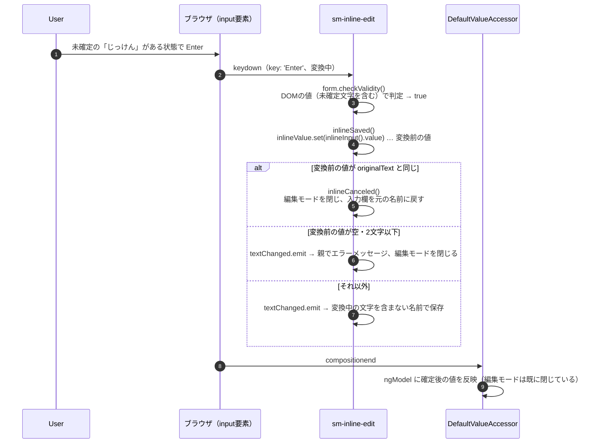

# インライン編集でIME確定のEnterにより編集が終了する原因と対策

## Q. 日本語変換を確定するためにEnterを押すと、インライン編集の入力待ち状態が終わってしまう。原因と対策は

対象は [inline-edit.component.html:36](../src/app/webapp-common/shared/ui-components/inputs/inline-edit/inline-edit.component.html#L36) です。

```html
(keydown.enter)="form.checkValidity() && inlineSaved()"
```

- **原因**：`(keydown.enter)` は、変換確定のEnterと通常のEnterを区別しません。変換確定のEnterでも `inlineSaved()` が呼ばれます。このときの ngModel の値は変換前のものなので、`inlineSaved()` は古い値で「取り消し」か「保存」を判定し、どちらの場合も編集モードを閉じます。
- **対策**：Enterのハンドラで、IME変換中のkeydownを除外します。判定は `event.isComposing || event.keyCode === 229` です。同じ問題を持つ箇所がほかにもあるため、判定を共通部品にまとめ、各所から使う形を推奨します。

## 原因

### 1. `keydown.enter` は `event.key` しか見ない

Angular の `KeyEventsPlugin` は、`event.key` が `'Enter'` かどうかだけを見てハンドラを呼びます。`isComposing` と `keyCode` は判定に使いません。

```js
// node_modules/@angular/platform-browser/fesm2022/_browser-chunk.mjs（22.1.5）
static matchEventFullKeyCode(event, fullKeyCode) {
  let keycode = _keyMap[event.key] || event.key;
  ...
  keycode = keycode.toLowerCase();
  ...
  key += keycode;
  return key === fullKeyCode;   // 'enter' と一致すれば true
}
```

変換確定のEnterで、ブラウザが `key: 'Enter'` の keydown を送ってくると、通常のEnterと同じくハンドラが動きます。

- [_browser-chunk.mjs:191](../node_modules/@angular/platform-browser/fesm2022/_browser-chunk.mjs#L191)

### 2. keydown の時点で ngModel は変換前の値

`DefaultValueAccessor`（`[(ngModel)]` と `<input>` をつなぐ部品）は、変換中の `input` イベントを無視し、`compositionend` で初めて値を ngModel へ渡します。Android 以外ではこの動作が既定です。

```js
// node_modules/@angular/forms/fesm2022/forms.mjs（22.1.5）
_handleInput(value) {
  if (!this._compositionMode || this._compositionMode && !this._composing) {
    this.onChange(value);          // 変換中は呼ばれない
  }
}
_compositionStart() { this._composing = true; }
_compositionEnd(value) {
  this._composing = false;
  this._compositionMode && this.onChange(value);   // ここで初めて反映
}
```

変換確定のEnterのkeydownは `compositionend` より前に届くことがあります。その場合、ハンドラが読む ngModel の値には、変換中の文字列が入っていません。

- [forms.mjs:174](../node_modules/@angular/forms/fesm2022/forms.mjs#L174)

### 3. `inlineSaved()` が古い値で判定する



`form.checkValidity()` はDOMの値を見ますが、`inlineSaved()` は ngModel の値を見ます。変換中はこの二つが食い違うため、検証は通っても保存・取り消しの判定には古い値が使われます。

表示される症状は、変換を始める前の ngModel の値で決まります。

| 変換を始める前の状態 | 変換確定のEnterで起きること |
|---|---|
| 元の名前のまま（範囲選択して上書き入力した場合など） | 編集が取り消され、入力欄が元の名前に戻る |
| Backspaceで消して空、または2文字以下 | 「Name must be more than three letters long」が出て編集が終わる |
| 変換前に確定済みの変更がある | 変換中の文字を含まない名前で保存され、編集が終わる |

- [inline-edit.component.ts:91](../src/app/webapp-common/shared/ui-components/inputs/inline-edit/inline-edit.component.ts#L91)（`inlineSaved()`）
- [base-experiment-output.component.ts:177](../src/app/webapp-common/experiments/containers/experiment-ouptut/base-experiment-output.component.ts#L177)（長さの確認とエラーメッセージ）

### ブラウザによる違い

変換確定時にどんな keydown が届くかは、ブラウザ・OS・IMEの組み合わせで変わります。一般に次の3通りが知られています。**この環境では実機のIMEで確認していません。**

| 届き方 | `key` | `isComposing` | `keyCode` | 本件の症状 |
|---|---|---|---|---|
| `compositionend` より前に届く（Chromium系で報告が多い） | `'Enter'` | `true` | `229` | 上の表のとおり |
| `compositionend` より後に届く（Safari） | `'Enter'` | `false` | `229` | ngModel は確定後の値になっている。変換確定と同時に保存され、編集が終わる |
| `key` が `'Process'` で届く | `'Process'` | `true` | `229` | `keydown.enter` に一致しないため起きない |

2番目の実装では `isComposing` が false になるため、`isComposing` だけでは除外できません。`keyCode === 229` の判定も必要です。

再現環境での届き方は、DevTools のコンソールで次のコードを実行すると確認できます。編集モードにしてから実行し、変換確定のEnterを押してください。

```js
const el = document.querySelector('.inline-edit-input');
['compositionstart', 'keydown', 'input', 'compositionend', 'keyup'].forEach(type =>
  el.addEventListener(type, e => console.log(type, e.key, e.keyCode, e.isComposing, el.value), true));
```

## 対策

### 推奨：変換中のkeydownを除外する判定を共通部品にする

IME変換中かどうかの判定を、共有ユーティリティ1か所にまとめます。非推奨APIの `keyCode` もここに閉じ込めます。

```ts
// src/app/webapp-common/shared/utils/keyboard-event.utils.ts
/**
 * IME変換中（変換確定のキー操作を含む）のキーボードイベントか。
 * Safari は compositionend の後に keydown を送り isComposing が false になるため、keyCode 229 も見る。
 */
export const isImeComposing = (event: KeyboardEvent): boolean =>
  event.isComposing || event.keyCode === 229;
```

Enterはアプリ全体で使うため、判定を組み込んだ共通ディレクティブにします。既存の [directives/](../src/app/webapp-common/shared/ui-components/directives/) に並べます。

```ts
// src/app/webapp-common/shared/ui-components/directives/ime-safe-enter.directive.ts
import {Directive, output} from '@angular/core';
import {isImeComposing} from '@common/shared/utils/keyboard-event.utils';

@Directive({
  selector: '[smImeSafeEnter]',
  host: {
    '(keydown.enter)': 'onEnter($event)'
  }
})
export class ImeSafeEnterDirective {
  readonly smImeSafeEnter = output<KeyboardEvent>();

  protected onEnter(event: KeyboardEvent) {
    if (isImeComposing(event)) {
      return;
    }
    this.smImeSafeEnter.emit(event);
  }
}
```

インライン編集側は、Enterをこのディレクティブの出力に置き換えます。Escも同じ問題を持ちます（IMEで変換を取り消すEscが、編集全体の取り消しになる）。Tabもあわせて、コンポーネントのメソッドで判定します。

```html
<!-- inline-edit.component.html -->
<input type="text" class="form-control inline-edit-input"
       ...
       (keydown.tab)="onTab($event, form)"
       (keydown.escape)="onEscape($event)"
       (smImeSafeEnter)="form.checkValidity() && inlineSaved()"
       #inlineInput="ngModel"/>
```

```ts
// inline-edit.component.ts（imports に ImeSafeEnterDirective を追加）
protected onTab(event: KeyboardEvent, form: HTMLFormElement) {
  if (isImeComposing(event)) {
    return;
  }
  if (form.checkValidity()) {
    this.inlineSaved();
  }
}

protected onEscape(event: KeyboardEvent) {
  if (isImeComposing(event)) {
    return;
  }
  this.inlineCanceled();
}
```

- Angularは出力名（`(smImeSafeEnter)`）もディレクティブのセレクタ照合に使います。属性 `smImeSafeEnter` を別に書く必要はありません（`@angular/compiler` の `getAttrsForDirectiveMatching` が `outputs` を照合対象に含めている）。
- 複数行モード（`textarea`）の `(keydown.tab)` と `(keydown.escape)` にも同じ判定を入れます。

### 別案：Enterをフォームの送信に一本化する

`(keydown.enter)` をやめ、`<form (ngSubmit)>` でEnterを受ける案です。変換確定のEnterではブラウザがフォームの暗黙送信を行わない、という挙動に頼ります。この挙動は実機で確認が必要です。

現状のテンプレートには、この案に関係する性質が一つあります。✓ボタンと×ボタンに `type` が無く、Angular Material も付けないため、どちらも `type="submit"` です。そのため通常のEnterでは、`(keydown.enter)` の後にフォームの暗黙送信が起き、先頭の✓ボタンに click が発生します。この順序は、同じ構造の素のHTMLを Chromium（Playwright）で動かして確認しました（`keydown.enter` → `ok.click` → `submit`）。つまり現状でも、✓ボタンが有効なときの通常のEnterでは、`inlineSaved()` が2回呼ばれる構造になっています（アプリ上での観測はしていません）。2回目の結果は、1回目の後に変更検知が `originalText` を更新済みかどうかで変わります。

この案では次のように直します。

- `<form #form ... (ngSubmit)="form.checkValidity() && inlineSaved()">` とする
- ✓ボタンは `type="submit"` を明示し、click での `inlineSaved()` 呼び出しをやめる
- ×ボタンは `type="button"` にする（押すとフォームが送信されないように）
- Tab・Escには推奨案と同じ判定が別途必要

非推奨の `keyCode` を使わずに済む点は利点です。ただし、IMEでの挙動をブラウザに任せることになり、テンプレートの変更も推奨案より大きくなります。

### 採らない方がよい案

| 案 | 理由 |
|---|---|
| `keyup.enter` に変える | 変換確定後の keyup は `compositionend` の後に `isComposing: false` で届く実装があり、変換確定と区別できない |
| `EVENT_MANAGER_PLUGINS` に独自プラグインを登録し、`keydown.enter` の意味をアプリ全体で変える | テンプレートを読んでも挙動が分からず、影響範囲がアプリ全体に広がる |
| `compositionstart` / `compositionend` で自前のフラグを持つ | Safari では keydown より先に `compositionend` が来るため、フラグが既に false になっている |

## 同じ問題を持つ箇所

文字入力欄のEnterで処理を実行している箇所です。IMEで入力する可能性があるものは、同じ対策の対象になります。

| 箇所 | バインド | Enterで起きること |
|---|---|---|
| [inline-edit.component.html:36](../src/app/webapp-common/shared/ui-components/inputs/inline-edit/inline-edit.component.html#L36) | `keydown.enter` | 保存 / 取り消し（本件） |
| [rename-dialog.component.html:12](../src/app/webapp-common/shared/ui-components/overlay/rename-dialog/rename-dialog.component.html#L12) | `keydown.enter` | ダイアログを確定して閉じる |
| [tags-menu.component.html:19](../src/app/webapp-common/shared/ui-components/tags/tags-menu/tags-menu.component.html#L19) | `keydown.enter` | タグを追加する |
| [experiment-execution-parameters.component.html:14](../src/app/webapp-common/experiments/dumb/experiment-execution-parameters/experiment-execution-parameters.component.html#L14) | `keydown.enter` | 次の行へ移る |
| [edit-credential-label-dialog.component.html:5](../src/app/webapp-common/shared/ui-components/overlay/edit-credential-label-dialog/edit-credential-label-dialog.component.html#L5) | `keyup.enter` | ダイアログを確定して閉じる |

`$event.preventDefault()` や `control.markAsTouched()` だけを行う箇所と、数値入力（`duration-input` など）の `keyup.enter` は、IMEによる実害が出にくいため対象から外しています。

## 検証範囲

- 確認済み：Angular 22.1.5 の `KeyEventsPlugin`・`DefaultValueAccessor`・`getAttrsForDirectiveMatching` のソース。Material のボタンが `type` を付けないこと。素のHTMLで Chromium の暗黙送信の順序。
- 未確認：実機IMEでの keydown の届き方（ブラウザ別の表）。別案が前提にしている「変換確定のEnterでは暗黙送信されない」挙動。
