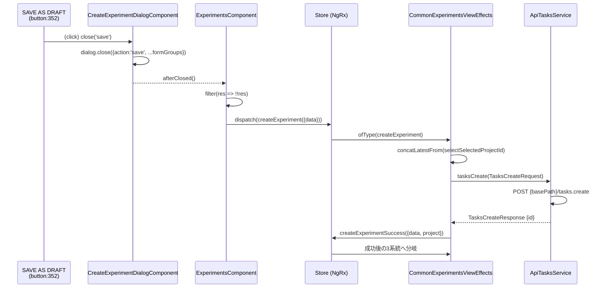

# ng-wiring 経路資料: CreateExperimentDialogComponent.button（src/app/webapp-common/experiments/containers/create-experiment-dialog/create-experiment-dialog.component.html:352）

- status: **partial**（未解決・未検出を含む。詳細は「診断と制限」）
- 対象: src/app/webapp-common/experiments/containers/create-experiment-dialog/create-experiment-dialog.component.html:352（[src/app/webapp-common/experiments/containers/create-experiment-dialog/create-experiment-dialog.component.html:352](../src/app/webapp-common/experiments/containers/create-experiment-dialog/create-experiment-dialog.component.html#L352)）
- 所有者: src/app/webapp-common/experiments/containers/create-experiment-dialog/create-experiment-dialog.component.ts#CreateExperimentDialogComponent
- クエリ: src/app/webapp-common/experiments/containers/create-experiment-dialog/create-experiment-dialog.component.html:352 / 絞り込み: event=click
- project: stackup（application） / tsconfig: tsconfig.app.json / 設定ハッシュ: `cc3c2d0123baa8877e48c1b586e88ad9b295a74de22561b1c5a7721c6a2aef11`
- strictNullChecks: false
- toolchain: TypeScript 6.0.3 / @angular/compiler 22.1.5 / ngmaze 6da35347018531df30659d34e66a11d1bfcc3f22
- entry: src/main.ts
- 未適用の設定: build configurations/defaultConfiguration, fileReplacements
- 走査から除外: なし
- snapshot: `db9aa43eeb777987cf7c8f52d5b04d1ac518fcfce7322658fbf24f7faf8c9e0d` / 解析開始: 2026-09-26T19:45:34.894+09:00 / ng-wiring 0.1.0 / schema 1.0.0
- 候補 ID: `cand:8f9bb71fae99fafb3e80442a1ebcb3d57a7a8b98049853acf34097eaf71d2f69`（分類 uninstantiated-fragment）
- 候補一覧: 1 件（列挙 完結）
- 表示経路: 1 件（終端 fragment-uninstantiated）
- route: なし
- bootstrap: 未到達
- イベント: click
- confidence: 表示経路 confirmed / click unresolved
- coverage: 全体 partial / 表示経路 partial / click complete-within-scope
- ファイル名元文字列: CreateExperimentDialogComponent.button-L352-2db261c1588f
- 重要な未解決理由:
  - Path ended at fragment-uninstantiated: TemplateRef saveButton has no confirmed insertion
  - view-relocation: NgTemplateOutlet relocates a view and is intentionally not represented as a component edge.
  - catalog-gap: src/app/webapp-common/experiments-compare/containers/experiment-compare-metric-values/experiment-compare-metric-values.component.ts#ExperimentCompareMetricValuesComponent: Host attributes are outside static template attribute matching
  - catalog-gap: src/app/webapp-common/pipelines-controller/pipeline-controller-info/pipeline-controller-info.component.ts#PipelineControllerInfoComponent: Host attributes are outside static template attribute matching
  - catalog-gap: src/app/webapp-common/shared/ui-components/directives/choose-color/choose-color.directive.ts#ChooseColorDirective: Host attributes are outside static template attribute matching
  - view-relocation: Embedded view creation changes runtime view topology and is not a component edge.
  - unresolved-dynamic-target: @angular/core createComponent target could not be resolved statically.
  - catalog-gap: src/app/webapp-common/shared/ui-components/indicators/divider/divider.component.ts#DividerComponent: Host attributes are outside static template attribute matching
  - catalog-gap: src/app/webapp-common/dashboard/containers/dashboard-reports/dashboard-reports.component.ts#DashboardReportsComponent: imports: unresolved MatAnchor
  - catalog-gap: src/app/webapp-common/angular-notifier/src/components/notifier-container.component.ts#NotifierContainerComponent: Host attributes are outside static template attribute matching
  - ほか 21 件（「診断と制限」を参照）

## 1. 表示経路

### 経路 1

- 節:  
  節 01: &lt;button&gt; [▶️](../src/app/webapp-common/experiments/containers/create-experiment-dialog/create-experiment-dialog.component.html) : ../src/app/webapp-common/experiments/containers/create-experiment-dialog/create-experiment-dialog.component.html  
  節 02: &lt;ng-template&gt; [▶️](../src/app/webapp-common/experiments/containers/create-experiment-dialog/create-experiment-dialog.component.html) : ../src/app/webapp-common/experiments/containers/create-experiment-dialog/create-experiment-dialog.component.html  
  節 03: boundary @src/app/webapp-common/experiments/containers/create-experiment-dialog/create-experiment-dialog.component.html:351 [▶️](../src/app/webapp-common/experiments/containers/create-experiment-dialog/create-experiment-dialog.component.html) : ../src/app/webapp-common/experiments/containers/create-experiment-dialog/create-experiment-dialog.component.html
- 終端: fragment-uninstantiated — TemplateRef saveButton has no confirmed insertion
- confidence: confirmed / coverage: partial
  - coverage 理由: Path ended at fragment-uninstantiated: TemplateRef saveButton has no confirmed insertion
- 宣言元: src/app/webapp-common/experiments/containers/create-experiment-dialog/create-experiment-dialog.component.ts#CreateExperimentDialogComponent（[src/app/webapp-common/experiments/containers/create-experiment-dialog/create-experiment-dialog.component.ts:140](../src/app/webapp-common/experiments/containers/create-experiment-dialog/create-experiment-dialog.component.ts#L140)）

## 2. コンポーネント節（子 → root）

### 01. &lt;button&gt;

- 種別: element / 役割: occurrence
- 位置: [src/app/webapp-common/experiments/containers/create-experiment-dialog/create-experiment-dialog.component.html:352](../src/app/webapp-common/experiments/containers/create-experiment-dialog/create-experiment-dialog.component.html#L352)
- 宣言元: 同一節内
- 挿入先: なし / 投影先: なし / route: なし
- `display-parent`（関連）&lt;button&gt; の表示上の親は &lt;ng-template&gt;。 確定度: confirmed。 出典: ng-wiring。  
  根拠: [src/app/webapp-common/experiments/containers/create-experiment-dialog/create-experiment-dialog.component.html:351](../src/app/webapp-common/experiments/containers/create-experiment-dialog/create-experiment-dialog.component.html#L351)

### 02. &lt;ng-template&gt;

- 種別: template / 役割: occurrence
- 位置: [src/app/webapp-common/experiments/containers/create-experiment-dialog/create-experiment-dialog.component.html:351](../src/app/webapp-common/experiments/containers/create-experiment-dialog/create-experiment-dialog.component.html#L351)
- 宣言元: 同一節内
- 挿入先: なし / 投影先: なし / route: なし

### 03. boundary @src/app/webapp-common/experiments/containers/create-experiment-dialog/create-experiment-dialog.component.html:351

- 種別: boundary / 役割: boundary
- 位置: [src/app/webapp-common/experiments/containers/create-experiment-dialog/create-experiment-dialog.component.html:351](../src/app/webapp-common/experiments/containers/create-experiment-dialog/create-experiment-dialog.component.html#L351)
- 宣言元: 同一節内
- 挿入先: なし / 投影先: なし / route: なし
- 追跡停止: TemplateRef saveButton has no confirmed insertion
- `boundary`（関連）src/app/webapp-common/experiments/containers/create-experiment-dialog/create-experiment-dialog.component.ts#CreateExperimentDialogComponent で追跡停止: TemplateRef saveButton has no confirmed insertion。 確定度: confirmed。 出典: ng-wiring。  
  根拠: [src/app/webapp-common/experiments/containers/create-experiment-dialog/create-experiment-dialog.component.html:351](../src/app/webapp-common/experiments/containers/create-experiment-dialog/create-experiment-dialog.component.html#L351)

## 3. イベント別の処理

### click

- 起点: 節 01 &lt;button&gt; / リスナー: click → close\('save'\)
- confidence: unresolved / coverage: complete-within-scope
- `dom-listener`（入力）&lt;button&gt; の click に対し src/app/webapp-common/experiments/containers/create-experiment-dialog/create-experiment-dialog.component.ts#CreateExperimentDialogComponent の close\('save'\) が登録されている。 確定度: conditional。 出典: ng-wiring。 条件: （actual DOM placement across component or projection boundary is unknown（scope: src/app/webapp-common/experiments/containers/create-experiment-dialog/create-experiment-dialog.component.ts#CreateExperimentDialogComponent） かつ disabled state may suppress user activation（scope: src/app/webapp-common/experiments/containers/create-experiment-dialog/create-experiment-dialog.component.ts#CreateExperimentDialogComponent））。  
  根拠: [src/app/webapp-common/experiments/containers/create-experiment-dialog/create-experiment-dialog.component.html:354](../src/app/webapp-common/experiments/containers/create-experiment-dialog/create-experiment-dialog.component.html#L354)
- `boundary`（関連）src/app/webapp-common/experiments/containers/create-experiment-dialog/create-experiment-dialog.component.ts#CreateExperimentDialogComponent で追跡停止: the receiver is an external package type, whose implementation this analysis does not traverse。 確定度: unresolved。 出典: ng-wiring。 条件: （actual DOM placement across component or projection boundary is unknown（scope: src/app/webapp-common/experiments/containers/create-experiment-dialog/create-experiment-dialog.component.ts#CreateExperimentDialogComponent） かつ disabled state may suppress user activation（scope: src/app/webapp-common/experiments/containers/create-experiment-dialog/create-experiment-dialog.component.ts#CreateExperimentDialogComponent） かつ importProvidersFrom at src/app/app.config.ts:46:7 contributes NgModule providers this analysis does not expand（scope: src/app/webapp-common/experiments/containers/create-experiment-dialog/create-experiment-dialog.component.ts#CreateExperimentDialogComponent） かつ /home/mtrysd/work\_2026/000-learn-ClearML-pro/node\_modules/@angular/material/types/\_dialog-chunk.d.ts:8187:MatDialogRef is declared by an external package, which supplies its own provider outside the analyzed sources（scope: src/app/webapp-common/experiments/containers/create-experiment-dialog/create-experiment-dialog.component.ts#CreateExperimentDialogComponent））。  
  根拠: [src/app/webapp-common/experiments/containers/create-experiment-dialog/create-experiment-dialog.component.ts:260](../src/app/webapp-common/experiments/containers/create-experiment-dialog/create-experiment-dialog.component.ts#L260)

### 通信

この探索範囲で通信への接続は未検出。coverage: 全体 partial。停止理由: fragment-uninstantiated: TemplateRef saveButton has no confirmed insertion, submit requires a form owner, an enabled submit control, and uncancelled default activation, ngmaze reported 86 components or edges outside this Program。アプリに通信が無いことを示すものではない。

## 4. 背景入力

- `reactive-link`（処理）queueFormGroup.controls.queue.valueChanges は angular/toSignal を介して queueVal に接続する（subscription）。 確定度: conditional。 出典: ng-wiring。 条件: （the internal subscription starts when the toSignal call runs（scope: node\_modules/@angular/forms/types/forms.d.ts:2703:5） かつ the internal subscription ends when the owning injection context is destroyed（scope: node\_modules/@angular/forms/types/forms.d.ts:2703:5））。  
  根拠: [src/app/webapp-common/experiments/containers/create-experiment-dialog/create-experiment-dialog.component.ts:209](../src/app/webapp-common/experiments/containers/create-experiment-dialog/create-experiment-dialog.component.ts#L209)
- `state-read`（状態）src/app/webapp-common/experiments/containers/create-experiment-dialog/create-experiment-dialog.component.ts#CreateExperimentDialogComponent のテンプレート が shell を読む（tracked）。 確定度: confirmed。 出典: ng-wiring。  
  根拠: [src/app/webapp-common/experiments/containers/create-experiment-dialog/create-experiment-dialog.component.html:112](../src/app/webapp-common/experiments/containers/create-experiment-dialog/create-experiment-dialog.component.html#L112)
- `state-read`（状態）src/app/webapp-common/experiments/containers/create-experiment-dialog/create-experiment-dialog.component.ts#CreateExperimentDialogComponent のテンプレート が shell を読む（tracked）。 確定度: confirmed。 出典: ng-wiring。  
  根拠: [src/app/webapp-common/experiments/containers/create-experiment-dialog/create-experiment-dialog.component.html:130](../src/app/webapp-common/experiments/containers/create-experiment-dialog/create-experiment-dialog.component.html#L130)
- `reactive-link`（処理）codeFormGroup.controls.binaryType.valueChanges     .pipe\(       map\(value =&gt; value === 'shell'\),       distinctUntilChanged\(\),     \) は angular/toSignal を介して shell に接続する（subscription）。 確定度: conditional。 出典: ng-wiring。 条件: （the internal subscription starts when the toSignal call runs（scope: node\_modules/rxjs/dist/types/internal/Observable.d.ts:103:5） かつ the internal subscription ends when the owning injection context is destroyed（scope: node\_modules/rxjs/dist/types/internal/Observable.d.ts:103:5））。  
  根拠: [src/app/webapp-common/experiments/containers/create-experiment-dialog/create-experiment-dialog.component.ts:210](../src/app/webapp-common/experiments/containers/create-experiment-dialog/create-experiment-dialog.component.ts#L210)
- `state-read`（状態）src/app/webapp-common/experiments/containers/create-experiment-dialog/create-experiment-dialog.component.ts#CreateExperimentDialogComponent のテンプレート が shell を読む（tracked）。 確定度: confirmed。 出典: ng-wiring。  
  根拠: [src/app/webapp-common/experiments/containers/create-experiment-dialog/create-experiment-dialog.component.html:10](../src/app/webapp-common/experiments/containers/create-experiment-dialog/create-experiment-dialog.component.html#L10)
- `state-read`（状態）src/app/webapp-common/experiments/containers/create-experiment-dialog/create-experiment-dialog.component.ts#CreateExperimentDialogComponent のテンプレート が shell を読む（tracked）。 確定度: confirmed。 出典: ng-wiring。  
  根拠: [src/app/webapp-common/experiments/containers/create-experiment-dialog/create-experiment-dialog.component.html:155](../src/app/webapp-common/experiments/containers/create-experiment-dialog/create-experiment-dialog.component.html#L155)

## 5. 除外した枝

偽と証明できた枝はない。

## 6. 診断と制限

### 診断

- [info] gap-relation: gap:9f75655f35c831277fb6f0c617570368eb6b391f5efdade3baf7e91135d9b18f を related と判定: a missed candidate cannot be ruled out: ngmaze reported 86 components or edges outside this Program  
  根拠: ソース位置なし
- [info] gap-relation: gap:c35c4c0c8a921aa308331a4d17ee7cdc7317f204bf14c51402cbcdb467b78ddf を related と判定: a missed candidate cannot be ruled out: ngmaze reported 86 components or edges outside this Program  
  根拠: ソース位置なし
- [info] gap-relation: gap:9c4146306a52be7eef52a9c52bef12c352d102970e9a666309b545884c91c201 を related と判定: owner src/app/webapp-common/experiments/containers/create-experiment-dialog/create-experiment-dialog.component.ts#CreateExperimentDialogComponent is the explored path src/app/webapp-common/experiments/containers/create-experiment-dialog/create-experiment-dialog.component.ts#CreateExperimentDialogComponent  
  根拠: ソース位置なし
- [info] gap-relation: gap:a40ed165086a0464ac7b0317e2cd7a44810dd10e3f2e839530e16f7934485305 を related と判定: a missed candidate cannot be ruled out: ngmaze reported 86 components or edges outside this Program  
  根拠: ソース位置なし
- [info] gap-relation: gap:95dbbc2d96484c889316f006fa58fe1571e6b9d63ddf30975d78a2007b00d873 を related と判定: a missed candidate cannot be ruled out: ngmaze reported 86 components or edges outside this Program  
  根拠: ソース位置なし
- [info] gap-relation: gap:e245d423069959a013bb05b0e8ebe8890fc782ec2bf738c4b1e0981c8e7e09a0 を related と判定: owner src/app/webapp-common/experiments/containers/create-experiment-dialog/create-experiment-dialog.component.ts#CreateExperimentDialogComponent is the explored path src/app/webapp-common/experiments/containers/create-experiment-dialog/create-experiment-dialog.component.ts#CreateExperimentDialogComponent  
  根拠: ソース位置なし
- [info] gap-relation: gap:7a07a2a36e108345ea8965265927fd0e79e89bc5b43d4a68e5fba8a032e58e94 を related と判定: a missed candidate cannot be ruled out: ngmaze reported 86 components or edges outside this Program  
  根拠: ソース位置なし
- [info] gap-relation: gap:250a74f8e376d6120293eb3cc152b6586d9ccb5d9564f7c5540e508c1063f222 を related と判定: a missed candidate cannot be ruled out: ngmaze reported 86 components or edges outside this Program  
  根拠: ソース位置なし
- [info] gap-relation: gap:06457b1970c75e2bb5014f2c80340bcb218ff5db6260062f8d6b5f997bacf8ae を related と判定: a missed candidate cannot be ruled out: ngmaze reported 86 components or edges outside this Program  
  根拠: ソース位置なし
- [info] gap-relation: gap:3f59f0377a489f267775bd4f6e3bb5c45e6afa6d60226ce629daa8537cbb21b2 を related と判定: owner src/app/webapp-common/experiments/containers/create-experiment-dialog/create-experiment-dialog.component.ts#CreateExperimentDialogComponent is the explored path src/app/webapp-common/experiments/containers/create-experiment-dialog/create-experiment-dialog.component.ts#CreateExperimentDialogComponent  
  根拠: ソース位置なし
- [info] gap-relation: gap:543e6de32545b176e1e78b19d0e330cbd72f1d71d6cec126b3d006fec3abe863 を related と判定: a missed candidate cannot be ruled out: ngmaze reported 86 components or edges outside this Program  
  根拠: ソース位置なし
- [warning] unresolved-dynamic: @angular/core createComponent target could not be resolved statically.  
  根拠: ソース位置なし
- [info] gap-relation: gap:1fe9ef1dcc5f68748cb86b6c8da9b71405d8c5a2156ac6d96ba8d655db6b66cb を related と判定: a missed candidate cannot be ruled out: ngmaze reported 86 components or edges outside this Program  
  根拠: ソース位置なし
- [warning] template-index: src/app/webapp-common/dashboard/containers/dashboard-reports/dashboard-reports.component.ts#DashboardReportsComponent: ngmaze template edge to src/app/webapp-common/shared/ui-components/panel/plus-card/plus-card.component.ts#PlusCardComponent was not confirmed at src/app/webapp-common/dashboard/containers/dashboard-reports/dashboard-reports.component.html:25  
  根拠: ソース位置なし
- [info] gap-relation: gap:f9e7c62291e0dd7e4827f940d10ec092da80bdd6e4aadc143a22702b2464ef82 を related と判定: a missed candidate cannot be ruled out: ngmaze reported 86 components or edges outside this Program  
  根拠: ソース位置なし
- [info] gap-relation: gap:baf608a1d3fcd3f93e1ba567a09d4674a1488b75dccb16180adb2fd4bab5a920 を related と判定: a missed candidate cannot be ruled out: ngmaze reported 86 components or edges outside this Program  
  根拠: ソース位置なし
- [info] gap-relation: gap:398095f58703f48a0555653aba0e15cfad32b547a9f0ea8196601595a7c516b4 を related と判定: a missed candidate cannot be ruled out: ngmaze reported 86 components or edges outside this Program  
  根拠: ソース位置なし
- [info] gap-relation: gap:2cde1ae81460eb4d4fa37afc4c637ee6034b029ee8762ae36349bf29576413a1 を related と判定: a missed candidate cannot be ruled out: ngmaze reported 86 components or edges outside this Program  
  根拠: ソース位置なし
- [info] gap-relation: gap:5d40100e121a724e521011bce1fb7e4472d60c246fd60fdf4bf74afb0a142228 を related と判定: a missed candidate cannot be ruled out: ngmaze reported 86 components or edges outside this Program  
  根拠: ソース位置なし
- [warning] catalog-gap: src/app/webapp-common/shared/ui-components/inputs/search/search.component.ts#SearchComponent: Host attributes are outside static template attribute matching  
  根拠: ソース位置なし
- [warning] catalog-gap: src/app/webapp-common/shared/ui-components/inputs/inline-edit/inline-edit.component.ts#InlineEditComponent: Host attributes are outside static template attribute matching  
  根拠: ソース位置なし
- [info] gap-relation: gap:6505e76b83eec9d2a10f54c45f2c2ac0001e8efc2f6d643ef0b8b6882e99a0f2 を related と判定: a missed candidate cannot be ruled out: ngmaze reported 86 components or edges outside this Program  
  根拠: ソース位置なし
- [info] gap-relation: gap:69c77c9f906ceb503e3ce2f5378072a627a7030072fce1eda195630a70da270d を related と判定: a missed candidate cannot be ruled out: ngmaze reported 86 components or edges outside this Program  
  根拠: ソース位置なし
- [info] gap-relation: gap:571e355c8986b22d1215280d1ed61b971b0111c205f707b0a8848a6137a01e85 を related と判定: a missed candidate cannot be ruled out: ngmaze reported 86 components or edges outside this Program  
  根拠: ソース位置なし
- [info] gap-relation: gap:4eb70d61d75f1991570cfa00f799a22aafdde054b59c864bf72b4e16b3324717 を related と判定: a missed candidate cannot be ruled out: ngmaze reported 86 components or edges outside this Program  
  根拠: ソース位置なし
- [info] gap-relation: gap:c14bb3f62784c5c214e5393776d3e64b778434952a313d543c41e0fb14b2fe60 を related と判定: a missed candidate cannot be ruled out: ngmaze reported 86 components or edges outside this Program  
  根拠: ソース位置なし
- [info] gap-relation: gap:60e8c21b7850ebbc32bf536775374398ed02845a9dd351387b22b767b44e23fc を related と判定: a missed candidate cannot be ruled out: ngmaze reported 86 components or edges outside this Program  
  根拠: ソース位置なし
- [info] gap-relation: gap:195a995bba2ccec120d194d4a403570cf186cb46d7e8b5189e7068507902cd53 を related と判定: a missed candidate cannot be ruled out: ngmaze reported 86 components or edges outside this Program  
  根拠: ソース位置なし
- [info] gap-relation: gap:9b1564ed07902e7f26bc2a81ce0953c5fdaa438af03ca8e509a2d85272b1bd93 を related と判定: a missed candidate cannot be ruled out: ngmaze reported 86 components or edges outside this Program  
  根拠: ソース位置なし
- [warning] catalog-gap: src/app/webapp-common/angular-notifier/src/components/notifier-container.component.ts#NotifierContainerComponent: Host attributes are outside static template attribute matching  
  根拠: ソース位置なし
- [info] gap-relation: gap:6a52deca8f79320ad4872be6f38ddb3f7a1f8c3467ecbef7c3bc8e093008bfdc を related と判定: a missed candidate cannot be ruled out: ngmaze reported 86 components or edges outside this Program  
  根拠: ソース位置なし
- [info] derived-event: click から submit への派生は境界: submit requires a form owner, an enabled submit control, and uncancelled default activation 停止理由: submit requires a form owner, an enabled submit control, and uncancelled default activation。  
  根拠: ソース位置なし
- [info] gap-relation: gap:269eb59fb48d8d67b464a323c5e15a481fdbc9b6a5189f99c4a4fcf9165df911 を related と判定: a missed candidate cannot be ruled out: ngmaze reported 86 components or edges outside this Program  
  根拠: ソース位置なし
- [info] gap-relation: gap:5257a61ea7ec6a9c956bbbc53474aa16e1703dbd97fbe10996e381656fc17cf0 を related と判定: a missed candidate cannot be ruled out: ngmaze reported 86 components or edges outside this Program  
  根拠: ソース位置なし
- [info] gap-relation: gap:815ab05d83dfc4a61385c6b25c770a7878451add990c7ba3e3463d3d87056d89 を related と判定: a missed candidate cannot be ruled out: ngmaze reported 86 components or edges outside this Program  
  根拠: ソース位置なし
- [info] gap-relation: gap:da931ca4fcf0b90a77b4846248cbdf7f5742e8bec5ae433994c91b5a5e40b423 を related と判定: a missed candidate cannot be ruled out: ngmaze reported 86 components or edges outside this Program  
  根拠: ソース位置なし
- [warning] catalog-gap: src/app/webapp-common/experiments-compare/containers/experiment-compare-hyper-params-graph/experiment-compare-hyper-params-graph.component.ts#ExperimentCompareHyperParamsGraphComponent: Host attributes are outside static template attribute matching  
  根拠: ソース位置なし
- [info] gap-relation: gap:eea41abeb827efffe9802a04adec48cc6709d8136821cc20b50ff39597424ebd を related と判定: a missed candidate cannot be ruled out: ngmaze reported 86 components or edges outside this Program  
  根拠: ソース位置なし
- [info] gap-relation: gap:01bc832de2e7a4bcc29c4c9be6df479aad3fbaba65fa7901acc47a0498b6f174 を related と判定: a missed candidate cannot be ruled out: ngmaze reported 86 components or edges outside this Program  
  根拠: ソース位置なし
- [warning] catalog-gap: src/app/webapp-common/layout/header/header.component.ts#HeaderComponent: Host attributes are outside static template attribute matching  
  根拠: ソース位置なし
- [info] gap-relation: gap:5822efd98dd7a469c410e71e92538251a4e13a68c6c758f7a81946ba6ab35e1f を related と判定: a missed candidate cannot be ruled out: ngmaze reported 86 components or edges outside this Program  
  根拠: ソース位置なし
- [warning] catalog-gap: src/app/webapp-common/shared/components/markdown-editor/markdown-editor.component.ts#MarkdownEditorComponent: Host attributes are outside static template attribute matching  
  根拠: ソース位置なし
- [info] gap-relation: gap:ca1319c37349b15e6dda57683a949d805c2ebcb6933452f8316384ff3e1e128a を related と判定: a missed candidate cannot be ruled out: ngmaze reported 86 components or edges outside this Program  
  根拠: ソース位置なし
- [warning] unresolved-dynamic: ngComponentOutlet target "compRef\(\)" could not be resolved statically.  
  根拠: ソース位置なし
- [warning] unresolved-dynamic: MatDialog.open target could not be resolved statically.  
  根拠: ソース位置なし
- [info] gap-relation: gap:59f3811eea3d22f22ad346e75f756635acdb2b3794f7d9bb5e30b1097736d33a を related と判定: a missed candidate cannot be ruled out: ngmaze reported 86 components or edges outside this Program  
  根拠: ソース位置なし
- [info] gap-relation: gap:f605854b1c158d45d17a869abf20e552a5cae9c78778b5ef6df820ac98a56973 を related と判定: a missed candidate cannot be ruled out: ngmaze reported 86 components or edges outside this Program  
  根拠: ソース位置なし
- [info] gap-relation: gap:7d7d7c7b3aa99003add77d39b1bdc41ba769306940d9dee1d788f75ab8a439a8 を related と判定: a missed candidate cannot be ruled out: ngmaze reported 86 components or edges outside this Program  
  根拠: ソース位置なし
- [warning] catalog-gap: src/app/webapp-common/pipelines-controller/pipeline-controller-info/pipeline-controller-info.component.ts#PipelineControllerInfoComponent: Host attributes are outside static template attribute matching  
  根拠: ソース位置なし
- [info] gap-relation: gap:fdba2768241626dd6fe5cf555f8ce5584481cf50d721dacc9fbf26a5c906b16f を related と判定: a missed candidate cannot be ruled out: ngmaze reported 86 components or edges outside this Program  
  根拠: ソース位置なし
- [info] gap-relation: gap:46b8783afc404c83330d52360699f14316db759f2674304a0ad332bcdddea7f5 を related と判定: a missed candidate cannot be ruled out: ngmaze reported 86 components or edges outside this Program  
  根拠: ソース位置なし
- [info] gap-relation: gap:5d09998687a94275ce9d022ae42ada61df011fec992b512796898eb01a1962b5 を related と判定: a missed candidate cannot be ruled out: ngmaze reported 86 components or edges outside this Program  
  根拠: ソース位置なし
- [info] gap-relation: gap:ed7d81f104bf02df1f4df9af2cc682d7b94196278b4a56639ca62972c3afe5f6 を related と判定: owner src/app/webapp-common/experiments/containers/create-experiment-dialog/create-experiment-dialog.component.ts#CreateExperimentDialogComponent is the explored path src/app/webapp-common/experiments/containers/create-experiment-dialog/create-experiment-dialog.component.ts#CreateExperimentDialogComponent  
  根拠: ソース位置なし
- [warning] catalog-gap: src/app/webapp-common/experiments-compare/containers/experiment-compare-plots/experiment-compare-plots.component.ts#ExperimentComparePlotsComponent: Host attributes are outside static template attribute matching  
  根拠: ソース位置なし
- [info] gap-relation: gap:eb53c59bdf4eae382a564a220c8e9009ad50e135c4f3873f1df3c1b0944804e4 を related と判定: a missed candidate cannot be ruled out: ngmaze reported 86 components or edges outside this Program  
  根拠: ソース位置なし
- [info] gap-relation: gap:3ba909a56f15d6937803a417d3918d7a88f3cf2f9fa9f898c323fae79be33c25 を related と判定: a missed candidate cannot be ruled out: ngmaze reported 86 components or edges outside this Program  
  根拠: ソース位置なし
- [info] gap-relation: gap:b6595dfd14cb9c4993ca24f17a2b8599e30a72e0ca6dead9e408f021d747c2d6 を related と判定: a missed candidate cannot be ruled out: ngmaze reported 86 components or edges outside this Program  
  根拠: ソース位置なし
- [warning] catalog-gap: src/app/webapp-common/experiments-compare/containers/experiment-compare-metric-charts/experiment-compare-scalar-charts.component.ts#ExperimentCompareScalarChartsComponent: Host attributes are outside static template attribute matching  
  根拠: ソース位置なし
- [info] gap-relation: gap:db0a44b67efea406f019aa165a0d3c52bc62cd39c839b7c428375b4045060ed6 を related と判定: a missed candidate cannot be ruled out: ngmaze reported 86 components or edges outside this Program  
  根拠: ソース位置なし
- [info] gap-relation: gap:63898a154d1f951bfde1f754c295545a7f81baf96f5cc0d573c30e503e1c3220 を related と判定: a missed candidate cannot be ruled out: ngmaze reported 86 components or edges outside this Program  
  根拠: ソース位置なし
- [info] gap-relation: gap:c345b6d411021ff6a77db2a87d811e5341e7d78e5fd0d68ce5c0800686ca4526 を related と判定: a missed candidate cannot be ruled out: ngmaze reported 86 components or edges outside this Program  
  根拠: ソース位置なし
- [info] gap-relation: gap:e6d0757c6051051b479c6e6e11aa2ef3ac63e45340b0c73399e779f121f94d92 を related と判定: a missed candidate cannot be ruled out: ngmaze reported 86 components or edges outside this Program  
  根拠: ソース位置なし
- [warning] ngmaze-edge-unverified: Received router-outlet edge was not confirmed by the local Program  
  根拠: ソース位置なし
- [info] gap-relation: gap:55d7f1571a54cb10a5cb8d90d311b06006fbfc979e314a0807375f55a994e250 を related と判定: a missed candidate cannot be ruled out: ngmaze reported 86 components or edges outside this Program  
  根拠: ソース位置なし
- [info] gap-relation: gap:c6230d74502c20229b182be84f578066c94c22ec5f347d53756037f9ca4104e1 を related と判定: a missed candidate cannot be ruled out: ngmaze reported 86 components or edges outside this Program  
  根拠: ソース位置なし
- [info] gap-relation: gap:defe931e15c0f5d5338cb0c00dc3690c25147f65abae8491d9fd7b2ed5c4e80e を related と判定: a missed candidate cannot be ruled out: ngmaze reported 86 components or edges outside this Program  
  根拠: ソース位置なし
- [info] gap-relation: gap:6eb3a0fc643a2d960437242c8d8b1976c16bcda8fe7252bdfc044279348dba5c を related と判定: a missed candidate cannot be ruled out: ngmaze reported 86 components or edges outside this Program  
  根拠: ソース位置なし
- [info] gap-relation: gap:001877155842fa7e2e75f896fb13a152cdcf0d7a8e5b09ccc9136dc8b2bbe62e を related と判定: owner src/app/webapp-common/experiments/containers/create-experiment-dialog/create-experiment-dialog.component.ts#CreateExperimentDialogComponent is the explored path src/app/webapp-common/experiments/containers/create-experiment-dialog/create-experiment-dialog.component.ts#CreateExperimentDialogComponent  
  根拠: ソース位置なし
- [info] gap-relation: gap:0dffa9a83c94da014f1e520113e8367363eec568681d977871c41bd82f454099 を related と判定: a missed candidate cannot be ruled out: ngmaze reported 86 components or edges outside this Program  
  根拠: ソース位置なし
- [info] gap-relation: gap:8df2e5626b5466fd6b9ece0c332223a3dc7c86c15003e581559094037fd2d847 を related と判定: a missed candidate cannot be ruled out: ngmaze reported 86 components or edges outside this Program  
  根拠: ソース位置なし
- [info] gap-relation: gap:45f55ba54de015f9f624d8b60e21ed3f18872ce015b40ad3df827ce47bc733a9 を related と判定: a missed candidate cannot be ruled out: ngmaze reported 86 components or edges outside this Program  
  根拠: ソース位置なし
- [info] gap-relation: gap:0cea915e75056ed2acb5b5b65a704c4aea335cf996e8b95a3da87f064d84a68b を related と判定: a missed candidate cannot be ruled out: ngmaze reported 86 components or edges outside this Program  
  根拠: ソース位置なし
- [info] gap-relation: gap:9648eebc80955eff9c632a0462c021b2addddf5ab56cf988ee610c3bd3848bed を related と判定: a missed candidate cannot be ruled out: ngmaze reported 86 components or edges outside this Program  
  根拠: ソース位置なし
- [warning] template-index: src/app/webapp-common/dashboard/containers/dashboard-reports/dashboard-reports.component.ts#DashboardReportsComponent: ngmaze template edge to src/app/webapp-common/reports/report-card/report-card.component.ts#ReportCardComponent was not confirmed at src/app/webapp-common/dashboard/containers/dashboard-reports/dashboard-reports.component.html:18  
  根拠: ソース位置なし
- [warning] catalog-gap: src/app/webapp-common/experiments-compare/containers/experiment-compare-metric-values/experiment-compare-metric-values.component.ts#ExperimentCompareMetricValuesComponent: Host attributes are outside static template attribute matching  
  根拠: ソース位置なし
- [info] gap-relation: gap:9888f35de0f41c713ff4fb9137d33fc7188a6610335d1412a3d1f3d74a1014d0 を related と判定: a missed candidate cannot be ruled out: ngmaze reported 86 components or edges outside this Program  
  根拠: ソース位置なし
- [info] gap-relation: gap:07e6675028ba5a548203eb1fd386d9f260f559bbe3b35b1e91c4ecf6c44bdd85 を related と判定: a missed candidate cannot be ruled out: ngmaze reported 86 components or edges outside this Program  
  根拠: ソース位置なし
- [info] gap-relation: gap:bc86c4925cec544d6ff4cfc4f0e294e3d8d8a21421193303d0740992d1de88ca を related と判定: a missed candidate cannot be ruled out: ngmaze reported 86 components or edges outside this Program  
  根拠: ソース位置なし
- [info] gap-relation: gap:a7ce31ccdaf8681a5432d4cfdce0782d687bc7e93233f7fc6b43555a70b67b4a を related と判定: a missed candidate cannot be ruled out: ngmaze reported 86 components or edges outside this Program  
  根拠: ソース位置なし
- [info] gap-relation: gap:61f5558d7df18afbf47cf5333e67ee389c1b01f677e2d8ebc9edc52d004aa5e9 を related と判定: a missed candidate cannot be ruled out: ngmaze reported 86 components or edges outside this Program  
  根拠: ソース位置なし
- [warning] ngmaze-unavailable: ngmaze reported 86 components or edges outside this Program 停止理由: ngmaze reported 86 components or edges outside this Program。  
  根拠: ソース位置なし
- [info] gap-relation: gap:2c7c8cacdde367623bbf113741e54817f444f838a23cd91d365afe609dbc24ff を related と判定: a missed candidate cannot be ruled out: ngmaze reported 86 components or edges outside this Program  
  根拠: ソース位置なし
- [info] gap-relation: gap:49d2deb62f5568ea4376b184e59af2d74c7731603660ef0ec4cfb17c07683ecc を related と判定: a missed candidate cannot be ruled out: ngmaze reported 86 components or edges outside this Program  
  根拠: ソース位置なし
- [info] gap-relation: gap:ceca928f3121476d2fd7a73029282355a16f34afea177a76e420b381f871a1a8 を related と判定: a missed candidate cannot be ruled out: ngmaze reported 86 components or edges outside this Program  
  根拠: ソース位置なし
- [warning] catalog-gap: src/app/webapp-common/shared/single-graph/graph-viewer/graph-viewer.component.ts#GraphViewerComponent: Host attributes are outside static template attribute matching  
  根拠: ソース位置なし
- [warning] catalog-gap: src/app/webapp-common/shared/ui-components/indicators/tooltip/show-tooltip-if-ellipsis.directive.ts#ShowTooltipIfEllipsisDirective: Host attributes are outside static template attribute matching  
  根拠: ソース位置なし
- [info] gap-relation: gap:85812b47261932f6628f46266a9ef13682370027668243f0a681a2a3641ea195 を related と判定: a missed candidate cannot be ruled out: ngmaze reported 86 components or edges outside this Program  
  根拠: ソース位置なし
- [info] gap-relation: gap:c8fa94021f18b917903abae58ce1ce739ffea5cd0873e6c75f29a00cf463bee9 を related と判定: a missed candidate cannot be ruled out: ngmaze reported 86 components or edges outside this Program  
  根拠: ソース位置なし
- [warning] catalog-gap: src/app/webapp-common/shared/ui-components/directives/choose-color/choose-color.directive.ts#ChooseColorDirective: Host attributes are outside static template attribute matching  
  根拠: ソース位置なし
- [info] gap-relation: gap:089a09a323a0c33110a9d4ac969147b2e011b47407815827df4a9507ebf77653 を related と判定: a missed candidate cannot be ruled out: ngmaze reported 86 components or edges outside this Program  
  根拠: ソース位置なし
- [info] gap-relation: gap:5670a45888d4a6e05a1db21f0a17e1a80b12b801c675f2a0b55a07ce2cad9a40 を related と判定: a missed candidate cannot be ruled out: ngmaze reported 86 components or edges outside this Program  
  根拠: ソース位置なし
- [info] gap-relation: gap:f244b8b68a3c7080f1b0dfcdfb1a3c09eec82491045748961178a36310f2ef7d を related と判定: a missed candidate cannot be ruled out: ngmaze reported 86 components or edges outside this Program  
  根拠: ソース位置なし
- [warning] catalog-gap: src/app/webapp-common/angular-notifier/src/components/notifier-notification.component.ts#NotifierNotificationComponent: Host attributes are outside static template attribute matching  
  根拠: ソース位置なし
- [info] gap-relation: gap:d95b06c7623df42ba709b58c004b2de4b5da899c050c8fd07acd09b7620374c0 を related と判定: a missed candidate cannot be ruled out: ngmaze reported 86 components or edges outside this Program  
  根拠: ソース位置なし
- [warning] catalog-gap: src/app/webapp-common/dashboard/containers/dashboard-reports/dashboard-reports.component.ts#DashboardReportsComponent: imports: unresolved MatAnchor  
  根拠: ソース位置なし
- [warning] catalog-gap: src/app/webapp-common/experiments-compare/dumbs/parallel-coordinates-graph/parallel-coordinates-graph.component.ts#ParallelCoordinatesGraphComponent: Host attributes are outside static template attribute matching  
  根拠: ソース位置なし
- [warning] catalog-gap: src/app/webapp-common/shared/single-graph/single-graph.component.ts#SingleGraphComponent: Runtime setAttribute is outside static template attribute matching  
  根拠: ソース位置なし
- [warning] catalog-gap: src/app/webapp-common/shared/ui-components/indicators/divider/divider.component.ts#DividerComponent: Host attributes are outside static template attribute matching  
  根拠: ソース位置なし
- [info] gap-relation: gap:f085f4e7dcc78967756d0a87b20313121ad06d61828228fb1bb411ee7706d236 を related と判定: a missed candidate cannot be ruled out: ngmaze reported 86 components or edges outside this Program  
  根拠: ソース位置なし
- [info] gap-relation: gap:f6e835b5088c416fd08892e2a7dcf1c03f3968a078f93f840201049758758036 を related と判定: a missed candidate cannot be ruled out: ngmaze reported 86 components or edges outside this Program  
  根拠: ソース位置なし
- [info] gap-relation: gap:b034ba860bbfd88f6c454d1098a4cce148217d3310c0b718dd3407964b0617ce を related と判定: a missed candidate cannot be ruled out: ngmaze reported 86 components or edges outside this Program  
  根拠: ソース位置なし

### coverage

- 全体: partial / 表示経路: partial
- イベント click: complete-within-scope
- 理由: Path ended at fragment-uninstantiated: TemplateRef saveButton has no confirmed insertion
- 理由: view-relocation: NgTemplateOutlet relocates a view and is intentionally not represented as a component edge.
- 理由: catalog-gap: src/app/webapp-common/experiments-compare/containers/experiment-compare-metric-values/experiment-compare-metric-values.component.ts#ExperimentCompareMetricValuesComponent: Host attributes are outside static template attribute matching
- 理由: catalog-gap: src/app/webapp-common/pipelines-controller/pipeline-controller-info/pipeline-controller-info.component.ts#PipelineControllerInfoComponent: Host attributes are outside static template attribute matching
- 理由: catalog-gap: src/app/webapp-common/shared/ui-components/directives/choose-color/choose-color.directive.ts#ChooseColorDirective: Host attributes are outside static template attribute matching
- 理由: view-relocation: Embedded view creation changes runtime view topology and is not a component edge.
- 理由: unresolved-dynamic-target: @angular/core createComponent target could not be resolved statically.
- 理由: catalog-gap: src/app/webapp-common/shared/ui-components/indicators/divider/divider.component.ts#DividerComponent: Host attributes are outside static template attribute matching
- 理由: catalog-gap: src/app/webapp-common/dashboard/containers/dashboard-reports/dashboard-reports.component.ts#DashboardReportsComponent: imports: unresolved MatAnchor
- 理由: catalog-gap: src/app/webapp-common/angular-notifier/src/components/notifier-container.component.ts#NotifierContainerComponent: Host attributes are outside static template attribute matching
- 理由: unresolved-dynamic-target: MatDialog.open target could not be resolved statically.
- 理由: unsupported-store-feature: selectTaskStore: 識別できない feature が state/member を上書きし得る
- 理由: program-scope: Unresolved import ../.env at /home/mtrysd/work\_2026/000-learn-ClearML-pro/src/main.ts:8
- 理由: catalog-gap: src/app/webapp-common/experiments-compare/containers/experiment-compare-metric-charts/experiment-compare-scalar-charts.component.ts#ExperimentCompareScalarChartsComponent: Host attributes are outside static template attribute matching
- 理由: catalog-gap: src/app/webapp-common/experiments-compare/dumbs/parallel-coordinates-graph/parallel-coordinates-graph.component.ts#ParallelCoordinatesGraphComponent: Host attributes are outside static template attribute matching
- 理由: catalog-gap: src/app/webapp-common/shared/ui-components/inputs/inline-edit/inline-edit.component.ts#InlineEditComponent: Host attributes are outside static template attribute matching
- 理由: catalog-gap: src/app/webapp-common/shared/single-graph/single-graph.component.ts#SingleGraphComponent: Runtime setAttribute is outside static template attribute matching
- 理由: unsupported-store-feature: ExperimentOutputLogStore: 識別できない feature が state/member を上書きし得る
- 理由: ngmaze-unavailable: ngmaze reported 86 components or edges outside this Program
- 理由: catalog-gap: src/app/webapp-common/shared/components/markdown-editor/markdown-editor.component.ts#MarkdownEditorComponent: Host attributes are outside static template attribute matching
- 理由: template-index: src/app/webapp-common/dashboard/containers/dashboard-reports/dashboard-reports.component.ts#DashboardReportsComponent: ngmaze template edge to src/app/webapp-common/shared/ui-components/panel/plus-card/plus-card.component.ts#PlusCardComponent was not confirmed at src/app/webapp-common/dashboard/containers/dashboard-reports/dashboard-reports.component.html:25
- 理由: catalog-gap: src/app/webapp-common/experiments-compare/containers/experiment-compare-plots/experiment-compare-plots.component.ts#ExperimentComparePlotsComponent: Host attributes are outside static template attribute matching
- 理由: template-index: src/app/webapp-common/dashboard/containers/dashboard-reports/dashboard-reports.component.ts#DashboardReportsComponent: ngmaze template edge to src/app/webapp-common/reports/report-card/report-card.component.ts#ReportCardComponent was not confirmed at src/app/webapp-common/dashboard/containers/dashboard-reports/dashboard-reports.component.html:18
- 理由: catalog-gap: src/app/webapp-common/angular-notifier/src/components/notifier-notification.component.ts#NotifierNotificationComponent: Host attributes are outside static template attribute matching
- 理由: catalog-gap: src/app/webapp-common/shared/ui-components/inputs/search/search.component.ts#SearchComponent: Host attributes are outside static template attribute matching
- 理由: catalog-gap: src/app/webapp-common/shared/ui-components/indicators/tooltip/show-tooltip-if-ellipsis.directive.ts#ShowTooltipIfEllipsisDirective: Host attributes are outside static template attribute matching
- 理由: catalog-gap: src/app/webapp-common/shared/single-graph/graph-viewer/graph-viewer.component.ts#GraphViewerComponent: Host attributes are outside static template attribute matching
- 理由: catalog-gap: src/app/webapp-common/experiments-compare/containers/experiment-compare-hyper-params-graph/experiment-compare-hyper-params-graph.component.ts#ExperimentCompareHyperParamsGraphComponent: Host attributes are outside static template attribute matching
- 理由: unsupported-store-feature: ProjectSettingsStore: 識別できない feature が state/member を上書きし得る
- 理由: catalog-gap: src/app/webapp-common/layout/header/header.component.ts#HeaderComponent: Host attributes are outside static template attribute matching
- 理由: unresolved-dynamic-target: ngComponentOutlet target "compRef\(\)" could not be resolved statically.

### 未検出範囲

関連する未検出:
- view-relocation: NgTemplateOutlet relocates a view and is intentionally not represented as a component edge.（owner src/app/webapp-common/experiments/containers/create-experiment-dialog/create-experiment-dialog.component.ts#CreateExperimentDialogComponent）
- catalog-gap: src/app/webapp-common/experiments-compare/containers/experiment-compare-metric-values/experiment-compare-metric-values.component.ts#ExperimentCompareMetricValuesComponent: Host attributes are outside static template attribute matching
- view-relocation: NgTemplateOutlet relocates a view and is intentionally not represented as a component edge.（owner src/app/webapp-common/shared/ui-components/data/table/table.component.ts#TableComponent）
- catalog-gap: src/app/webapp-common/pipelines-controller/pipeline-controller-info/pipeline-controller-info.component.ts#PipelineControllerInfoComponent: Host attributes are outside static template attribute matching
- view-relocation: NgTemplateOutlet relocates a view and is intentionally not represented as a component edge.（owner src/app/webapp-common/experiments-compare/dumbs/compare-card-list/compare-card-list.component.ts#CompareCardListComponent）
- catalog-gap: src/app/webapp-common/shared/ui-components/directives/choose-color/choose-color.directive.ts#ChooseColorDirective: Host attributes are outside static template attribute matching
- view-relocation: NgTemplateOutlet relocates a view and is intentionally not represented as a component edge.（owner src/app/webapp-common/shared/ui-components/data/table/table.component.ts#TableComponent）
- view-relocation: NgTemplateOutlet relocates a view and is intentionally not represented as a component edge.（owner src/app/webapp-common/shared/ui-components/data/table-card/table-card.component.ts#TableCardComponent）
- view-relocation: Embedded view creation changes runtime view topology and is not a component edge.
- view-relocation: NgTemplateOutlet relocates a view and is intentionally not represented as a component edge.（owner src/app/webapp-common/shared/ui-components/data/table/table.component.ts#TableComponent）
- view-relocation: NgTemplateOutlet relocates a view and is intentionally not represented as a component edge.（owner src/app/webapp-common/experiments-compare/containers/select-experiments-for-compare/select-experiments-for-compare.component.ts#SelectExperimentsForCompareComponent）
- unresolved-dynamic-target: @angular/core createComponent target could not be resolved statically.
- catalog-gap: src/app/webapp-common/shared/ui-components/indicators/divider/divider.component.ts#DividerComponent: Host attributes are outside static template attribute matching
- view-relocation: NgTemplateOutlet relocates a view and is intentionally not represented as a component edge.（owner src/app/webapp-common/experiments/dumb/experiment-custom-cols-menu/experiment-custom-cols-menu.component.ts#ExperimentCustomColsMenuComponent）
- catalog-gap: src/app/webapp-common/dashboard/containers/dashboard-reports/dashboard-reports.component.ts#DashboardReportsComponent: imports: unresolved MatAnchor
- view-relocation: NgTemplateOutlet relocates a view and is intentionally not represented as a component edge.（owner src/app/webapp-common/experiments/containers/create-experiment-dialog/create-experiment-dialog.component.ts#CreateExperimentDialogComponent）
- view-relocation: NgTemplateOutlet relocates a view and is intentionally not represented as a component edge.（owner src/app/webapp-common/dashboard-search/search-results-table/search-results-table.component.ts#SearchResultsTableComponent）
- view-relocation: NgTemplateOutlet relocates a view and is intentionally not represented as a component edge.（owner src/app/webapp-common/shared/ui-components/data/table/table.component.ts#TableComponent）
- view-relocation: Embedded view creation changes runtime view topology and is not a component edge.
- catalog-gap: src/app/webapp-common/angular-notifier/src/components/notifier-container.component.ts#NotifierContainerComponent: Host attributes are outside static template attribute matching
- view-relocation: NgTemplateOutlet relocates a view and is intentionally not represented as a component edge.（owner src/app/webapp-common/shared/components/dynamic-label-list/dynamic-label-list.component.ts#DynamicLabelListComponent）
- view-relocation: NgTemplateOutlet relocates a view and is intentionally not represented as a component edge.（owner src/app/webapp-common/shared/components/multi-line-tooltip/multi-line-tooltip.component.ts#MultiLineTooltipComponent）
- view-relocation: NgTemplateOutlet relocates a view and is intentionally not represented as a component edge.（owner src/app/webapp-common/pipelines/pipelines-page/pipelines-empty-state/pipelines-empty-state.component.ts#PipelinesEmptyStateComponent）
- view-relocation: NgTemplateOutlet relocates a view and is intentionally not represented as a component edge.（owner src/app/webapp-common/experiments/dumb/experiments-table/experiments-table.component.ts#ExperimentsTableComponent）
- unresolved-dynamic-target: MatDialog.open target could not be resolved statically.（owner src/app/webapp-common/layout/header/header.component.ts#HeaderComponent）
- view-relocation: NgTemplateOutlet relocates a view and is intentionally not represented as a component edge.（owner src/app/webapp-common/shared/ui-components/data/table/table.component.ts#TableComponent）
- view-relocation: NgTemplateOutlet relocates a view and is intentionally not represented as a component edge.（owner src/app/webapp-common/experiments/dumb/experiment-header/experiment-header.component.ts#ExperimentHeaderComponent）
- unsupported-store-feature: selectTaskStore: 識別できない feature が state/member を上書きし得る
- view-relocation: NgTemplateOutlet relocates a view and is intentionally not represented as a component edge.（owner src/app/webapp-common/shared/single-value-summary-table/single-value-summary-table.component.ts#SingleValueSummaryTableComponent）
- view-relocation: NgTemplateOutlet relocates a view and is intentionally not represented as a component edge.（owner src/app/webapp-common/angular-notifier/src/components/notifier-notification.component.ts#NotifierNotificationComponent）
- view-relocation: NgTemplateOutlet relocates a view and is intentionally not represented as a component edge.（owner src/app/webapp-common/experiments-compare/dumbs/compare-card-list/compare-card-list.component.ts#CompareCardListComponent）
- view-relocation: NgTemplateOutlet relocates a view and is intentionally not represented as a component edge.（owner src/app/webapp-common/nested-project-view/nested-project-view-page/nested-project-view-page.component.ts#NestedProjectViewPageComponent）
- view-relocation: NgTemplateOutlet relocates a view and is intentionally not represented as a component edge.（owner src/app/webapp-common/nested-project-view/nested-project-view-page/nested-project-view-page.component.ts#NestedProjectViewPageComponent）
- view-relocation: NgTemplateOutlet relocates a view and is intentionally not represented as a component edge.（owner src/app/webapp-common/datasets/dataset-empty/dataset-empty.component.ts#DatasetEmptyComponent）
- view-relocation: NgTemplateOutlet relocates a view and is intentionally not represented as a component edge.（owner src/app/webapp-common/shared/ui-components/data/table/table.component.ts#TableComponent）
- program-scope: Unresolved import ../.env at /home/mtrysd/work\_2026/000-learn-ClearML-pro/src/main.ts:8
- view-relocation: NgTemplateOutlet relocates a view and is intentionally not represented as a component edge.（owner src/app/webapp-common/shared/ui-components/data/table-card/table-card.component.ts#TableCardComponent）
- view-relocation: NgTemplateOutlet relocates a view and is intentionally not represented as a component edge.（owner src/app/webapp-common/experiments/containers/experiment-info-execution/experiment-info-execution.component.ts#ExperimentInfoExecutionComponent）
- view-relocation: NgTemplateOutlet relocates a view and is intentionally not represented as a component edge.（owner src/app/webapp-common/experiments/containers/experiment-info-execution/experiment-info-execution.component.ts#ExperimentInfoExecutionComponent）
- catalog-gap: src/app/webapp-common/experiments-compare/containers/experiment-compare-metric-charts/experiment-compare-scalar-charts.component.ts#ExperimentCompareScalarChartsComponent: Host attributes are outside static template attribute matching
- view-relocation: NgTemplateOutlet relocates a view and is intentionally not represented as a component edge.（owner src/app/webapp-common/datasets/dataset-empty/dataset-empty.component.ts#DatasetEmptyComponent）
- catalog-gap: src/app/webapp-common/experiments-compare/dumbs/parallel-coordinates-graph/parallel-coordinates-graph.component.ts#ParallelCoordinatesGraphComponent: Host attributes are outside static template attribute matching
- catalog-gap: src/app/webapp-common/shared/ui-components/inputs/inline-edit/inline-edit.component.ts#InlineEditComponent: Host attributes are outside static template attribute matching
- view-relocation: NgTemplateOutlet relocates a view and is intentionally not represented as a component edge.（owner src/app/webapp-common/shared/components/virtual-grid/virtual-grid.component.ts#VirtualGridComponent）
- view-relocation: NgTemplateOutlet relocates a view and is intentionally not represented as a component edge.（owner src/app/webapp-common/experiments/dumb/experiment-custom-cols-menu/experiment-custom-cols-menu.component.ts#ExperimentCustomColsMenuComponent）
- view-relocation: NgTemplateOutlet relocates a view and is intentionally not represented as a component edge.（owner src/app/webapp-common/experiments/containers/create-experiment-dialog/create-experiment-dialog.component.ts#CreateExperimentDialogComponent）
- view-relocation: NgTemplateOutlet relocates a view and is intentionally not represented as a component edge.（owner src/app/webapp-common/shared/ui-components/overlay/confirm-dialog/confirm-dialog.component.ts#ConfirmDialogComponent）
- catalog-gap: src/app/webapp-common/shared/single-graph/single-graph.component.ts#SingleGraphComponent: Runtime setAttribute is outside static template attribute matching
- view-relocation: NgTemplateOutlet relocates a view and is intentionally not represented as a component edge.（owner src/app/webapp-common/experiments/containers/experiment-info-model/experiment-info-model.component.ts#ExperimentInfoModelComponent）
- view-relocation: NgTemplateOutlet relocates a view and is intentionally not represented as a component edge.（owner src/app/webapp-common/experiments-compare/dumbs/compare-card-list/compare-card-list.component.ts#CompareCardListComponent）
- view-relocation: NgTemplateOutlet relocates a view and is intentionally not represented as a component edge.（owner src/app/webapp-common/shared/ui-components/data/table/table.component.ts#TableComponent）
- view-relocation: NgTemplateOutlet relocates a view and is intentionally not represented as a component edge.（owner src/app/webapp-common/experiments/containers/experiment-info-aritfacts/experiment-info-artifacts.component.ts#ExperimentInfoArtifactsComponent）
- unsupported-store-feature: ExperimentOutputLogStore: 識別できない feature が state/member を上書きし得る
- view-relocation: NgTemplateOutlet relocates a view and is intentionally not represented as a component edge.（owner src/app/webapp-common/shared/ui-components/data/simple-table/simple-table.component.ts#SimpleTableComponent）
- view-relocation: NgTemplateOutlet relocates a view and is intentionally not represented as a component edge.（owner src/app/webapp-common/experiments-compare/containers/select-experiments-for-compare/select-experiments-for-compare.component.ts#SelectExperimentsForCompareComponent）
- view-relocation: NgTemplateOutlet relocates a view and is intentionally not represented as a component edge.（owner src/app/webapp-common/shared/ui-components/data/table/table.component.ts#TableComponent）
- view-relocation: NgTemplateOutlet relocates a view and is intentionally not represented as a component edge.（owner src/app/webapp-common/shared/ui-components/data/table/table.component.ts#TableComponent）
- ngmaze-unavailable: ngmaze reported 86 components or edges outside this Program
- catalog-gap: src/app/webapp-common/shared/components/markdown-editor/markdown-editor.component.ts#MarkdownEditorComponent: Host attributes are outside static template attribute matching
- template-index: src/app/webapp-common/dashboard/containers/dashboard-reports/dashboard-reports.component.ts#DashboardReportsComponent: ngmaze template edge to src/app/webapp-common/shared/ui-components/panel/plus-card/plus-card.component.ts#PlusCardComponent was not confirmed at src/app/webapp-common/dashboard/containers/dashboard-reports/dashboard-reports.component.html:25（owner src/app/webapp-common/dashboard/containers/dashboard-reports/dashboard-reports.component.ts#DashboardReportsComponent）
- unresolved-dynamic-target: @angular/core createComponent target could not be resolved statically.
- catalog-gap: src/app/webapp-common/experiments-compare/containers/experiment-compare-plots/experiment-compare-plots.component.ts#ExperimentComparePlotsComponent: Host attributes are outside static template attribute matching
- template-index: src/app/webapp-common/dashboard/containers/dashboard-reports/dashboard-reports.component.ts#DashboardReportsComponent: ngmaze template edge to src/app/webapp-common/reports/report-card/report-card.component.ts#ReportCardComponent was not confirmed at src/app/webapp-common/dashboard/containers/dashboard-reports/dashboard-reports.component.html:18（owner src/app/webapp-common/dashboard/containers/dashboard-reports/dashboard-reports.component.ts#DashboardReportsComponent）
- catalog-gap: src/app/webapp-common/angular-notifier/src/components/notifier-notification.component.ts#NotifierNotificationComponent: Host attributes are outside static template attribute matching
- view-relocation: NgTemplateOutlet relocates a view and is intentionally not represented as a component edge.（owner src/app/webapp-common/experiments/containers/create-experiment-dialog/create-experiment-dialog.component.ts#CreateExperimentDialogComponent）
- view-relocation: NgTemplateOutlet relocates a view and is intentionally not represented as a component edge.（owner src/app/webapp-common/shared/components/json-viewer/json-viewer.component.ts#JsonViewerComponent）
- catalog-gap: src/app/webapp-common/shared/ui-components/inputs/search/search.component.ts#SearchComponent: Host attributes are outside static template attribute matching
- view-relocation: NgTemplateOutlet relocates a view and is intentionally not represented as a component edge.（owner src/app/webapp-common/experiments/containers/create-experiment-dialog/create-experiment-dialog.component.ts#CreateExperimentDialogComponent）
- catalog-gap: src/app/webapp-common/shared/ui-components/indicators/tooltip/show-tooltip-if-ellipsis.directive.ts#ShowTooltipIfEllipsisDirective: Host attributes are outside static template attribute matching
- catalog-gap: src/app/webapp-common/shared/single-graph/graph-viewer/graph-viewer.component.ts#GraphViewerComponent: Host attributes are outside static template attribute matching
- catalog-gap: src/app/webapp-common/experiments-compare/containers/experiment-compare-hyper-params-graph/experiment-compare-hyper-params-graph.component.ts#ExperimentCompareHyperParamsGraphComponent: Host attributes are outside static template attribute matching
- unsupported-store-feature: ProjectSettingsStore: 識別できない feature が state/member を上書きし得る
- catalog-gap: src/app/webapp-common/layout/header/header.component.ts#HeaderComponent: Host attributes are outside static template attribute matching
- unresolved-dynamic-target: ngComponentOutlet target "compRef\(\)" could not be resolved statically.（owner src/app/webapp-common/shared/components/dropdown-object-select/dropdown-object-select.component.ts#DropdownObjectSelectComponent）
- view-relocation: NgTemplateOutlet relocates a view and is intentionally not represented as a component edge.（owner src/app/webapp-common/login/login/login.component.ts#LoginComponent）

ng-wiring が補完した未検出（原記録を残す。active な欠落には数えない）:
- なし

解析全体の未検出範囲:
- なし

対象外の未検出（コード別件数）:
- なし

### 制限

- view-depth: 上限 200 / 停止 0 / 未探索 0
- view-paths: 上限 1000 / 停止 0 / 未探索 0
- view-states: 上限 100000 / 停止 0 / 未探索 0


---

## 7. 未解決点の手動追補

本文の status が **partial** なのは、ng-wiring の解析境界が 2 箇所あるため。どちらも手動で追い切ったので以下に補う。

### 7-1. 表示経路（`fragment-uninstantiated` の補完）

SAVE AS DRAFT は `<ng-template #saveButton>` の中にあり、`*ngTemplateOutlet` によるビュー再配置は ng-wiring がコンポーネント辺として表現しない仕様のため、起点からの経路が切れていた。

同じ `<div class="buttons">` 内の兄弟ボタン（[create-experiment-dialog.component.html:173](../src/app/webapp-common/experiments/containers/create-experiment-dialog/create-experiment-dialog.component.html#L173) の RUN）を起点に解析すると、同一の表示経路が取得できる。

```text
07. newExperiment() → MatDialog.open   experiments.component.ts:782
06. <sm-dialog-template>               create-experiment-dialog.component.html:1
05. @else                              create-experiment-dialog.component.html:20
04. <mat-stepper>                      create-experiment-dialog.component.html:21
03. <mat-step>                         create-experiment-dialog.component.html:22
02. <ng-container *ngTemplateOutlet="saveButton">  create-experiment-dialog.component.html:172 / 206 / 277 / 298 / 335
01. <button> SAVE AS DRAFT             create-experiment-dialog.component.html:352
```

- 起点は [experiments.component.ts:782](../src/app/webapp-common/experiments/experiments.component.ts#L782) の `MatDialog.open()`。ダイアログは動的生成なので route は持たない。
- `#saveButton` は 5 箇所（172 / 206 / 277 / 298 / 335 行）から挿入される。ステッパーの各ステップに同じボタンが出るため、押下時のステップに関わらず到達先の処理は同一。
- 参考資料: `ngwi-05-CreateExperimentDialogComponent.button-L173-*.md`

### 7-2. click 以降（`MatDialogRef` 境界の先）

`close('save')` は [create-experiment-dialog.component.ts:259-260](../src/app/webapp-common/experiments/containers/create-experiment-dialog/create-experiment-dialog.component.ts#L259) で `MatDialogRef.close()` を呼ぶだけ。`MatDialogRef` は @angular/material の外部型なので ng-wiring はそこで停止する。実処理はダイアログを開いた側にある。



**コード位置**

| # | 処理 | 位置 |
| --- | --- | --- |
| 1 | `dialog.close()` で結果を返す | [create-experiment-dialog.component.ts:259](../src/app/webapp-common/experiments/containers/create-experiment-dialog/create-experiment-dialog.component.ts#L259) |
| 2 | `afterClosed()` を購読し dispatch | [experiments.component.ts:781-788](../src/app/webapp-common/experiments/experiments.component.ts#L781) |
| 3 | action 定義 | [common-experiments-view.actions.ts:309](../src/app/webapp-common/experiments/actions/common-experiments-view.actions.ts#L309) |
| 4 | effect で API 呼び出し | [common-experiments-view.effects.ts:868](../src/app/webapp-common/experiments/effects/common-experiments-view.effects.ts#L868) |
| 5 | HTTP `POST /tasks.create` | [tasks.service.ts:479](../src/app/business-logic/api-services/tasks.service.ts#L479) |

**渡るデータ**

`close('save')` が返すのは `createExperimentDialogResult`（[create-experiment-dialog.component.ts:63](../src/app/webapp-common/experiments/containers/create-experiment-dialog/create-experiment-dialog.component.ts#L63)）。`action: 'save'` に各 FormGroup（`codeFormGroup` / `argsFormGroup` / `dockerFormGroup` / `queueFormGroup` など）の値を展開したもの。effect 側で `TasksCreateRequest` に組み替えられる。

- `taskNameField`（`formControlName="name"`）の値は `action.data.name` → リクエストの `name` になる。
- `project` はフォームではなく `selectSelectedProjectId` セレクタから補われる。

**成功後の分岐**（`createExperimentSuccess` を受ける effect が 3 つ）

| effect | 位置 | 内容 |
| --- | --- | --- |
| `createExperimentSuccess` | [effects.ts:916](../src/app/webapp-common/experiments/effects/common-experiments-view.effects.ts#L916) | 成功通知＋「open task」アクション（押すと `openExperiment` → `/projects/{project}/tasks/{id}` へ遷移） |
| `updateExperimentsAfterCreate` | [effects.ts:923](../src/app/webapp-common/experiments/effects/common-experiments-view.effects.ts#L923) | `refreshExperiments` で一覧を再取得 |
| `enqueueCreateExperiment` | [effects.ts:937](../src/app/webapp-common/experiments/effects/common-experiments-view.effects.ts#L937) | `data.queue` があるときだけ `tasksEnqueue` を呼ぶ |

**SAVE AS DRAFT と RUN の違い**

処理経路は同一で、`close()` に渡す `action` 文字列（`'save'` / `'run'`）だけが違う。ただし `enqueueCreateExperiment` は `filter(action => !!action.data.queue)` で分岐するため、キュー未選択のまま保存すれば `tasks.create` のみで終わり、タスクは Draft のまま残る。失敗時は `catchError` で `Failed to create tasks.` のエラーメッセージが出る。

### 7-3. この資料の再現コマンド

```bash
# 本文（SAVE AS DRAFT 本体）
npx mergelog/ng-wiring --source 'src/app/webapp-common/experiments/containers/create-experiment-dialog/create-experiment-dialog.component.html:352' --event click --detail --out-dir x-ngwi

# 7-1 の表示経路（兄弟ボタン起点）
npx mergelog/ng-wiring --source 'src/app/webapp-common/experiments/containers/create-experiment-dialog/create-experiment-dialog.component.html:173' --out-dir x-ngwi
```

`--selector` は効かない。DevTools の Copy selector が返す `#cdk-stepper-0-content-0 > div > button:nth-child(2)` にはコンポーネントのホストタグが含まれず、`--selector contains no component host tag found in the candidates`（exit 3）になる。また `*ngTemplateOutlet` を書いた `<ng-container>` 行（172 など）を `--source` に指定すると `Model validation failed: Selection refers to unknown node undefined`（exit 4）で失敗する。
