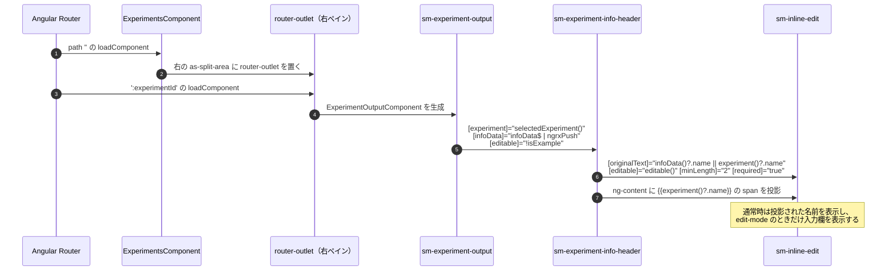
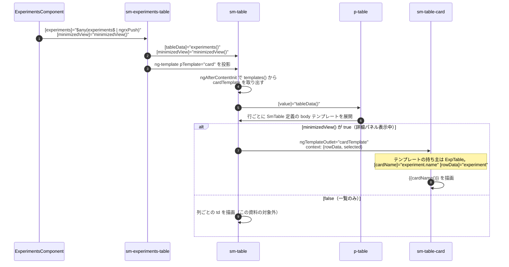
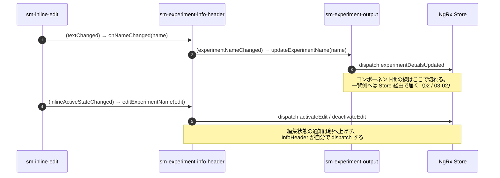

# 01 コンポーネント経路

名前を入力する `sm-inline-edit` と、新しい名前を表示する `sm-table-card` は、どちらも `ExperimentsComponent` の配下にある。
ただし入力側は `router-outlet` 経由、表示側はテンプレート直書きで、経路が違う。

```text
ExperimentsComponent
├─ as-split-area（左）
│   └─ sm-experiments-table
│       └─ sm-table
│           └─ p-table
│               └─ 各行: cardTemplate → sm-table-card      ← 新しい名前が出る
└─ as-split-area（右）
    └─ router-outlet（:experimentId）
        └─ sm-experiment-output
            └─ sm-experiment-info-header
                └─ sm-inline-edit                          ← 名前を入力する
```

## 図1: 入力欄までの経路



- `isExample` は `isReadOnly(selectedExperiment())` の結果。サンプル実験は編集できない。
- 入力欄の初期値 `originalText` は `infoData` の名前を優先する。表示用の span は `experiment()`（`info.selectedExperiment`）の名前を使う。二つの出どころは [02](./02_状態経路.md) で扱う。

## 図2: 一覧カードまでの経路



- `minimizedView()` は `selectMinimizedView` から来る Signal。URL パラメータに `experimentId` があれば true。
- カードのテンプレートは ExpTable が書き、SmTable が実体化する。ExpTable は `experiment.name` を直接 `cardName` に渡すだけで、名前を加工しない。

## 図3: 名前が確定したときの通知経路



## 読みどころ

- 右ペインの router-outlet: [experiments.component.html:126](../../src/app/webapp-common/experiments/experiments.component.html#L126)
- `:experimentId` の子ルート: [experiment-routes.ts:76](../../src/app/webapp-common/experiments/experiment-routes.ts#L76)
- ヘッダーへの入力: [experiment-output.component.html:6](../../src/app/features/experiments/containers/experiment-ouptut/experiment-output.component.html#L6)
- インライン編集の配置: [experiment-info-header.component.html:8](../../src/app/webapp-common/experiments/dumb/experiment-info-header/experiment-info-header.component.html#L8)
- 一覧テーブルへの入力: [experiments.component.html:69](../../src/app/webapp-common/experiments/experiments.component.html#L69)
- sm-table への受け渡し: [experiments-table.component.html:3](../../src/app/webapp-common/experiments/dumb/experiments-table/experiments-table.component.html#L3)
- cardTemplate の取り出し: [table.component.ts:340](../../src/app/webapp-common/shared/ui-components/data/table/table.component.ts#L340)
- cardTemplate の実体化: [table.component.html:164](../../src/app/webapp-common/shared/ui-components/data/table/table.component.html#L164)
- カードテンプレート本体: [experiments-table.component.html:215](../../src/app/webapp-common/experiments/dumb/experiments-table/experiments-table.component.html#L215)
