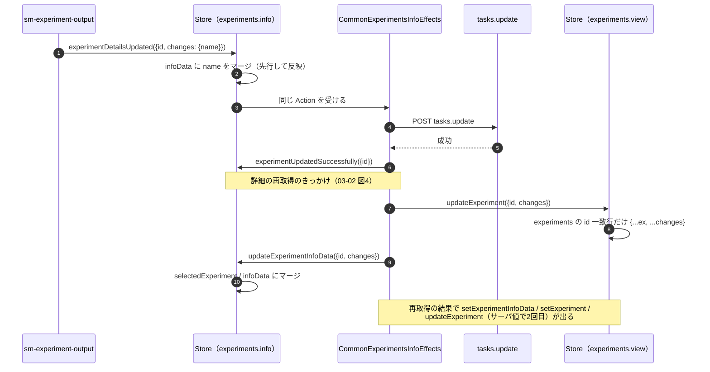
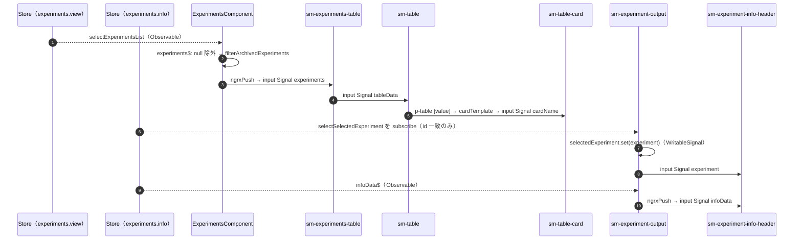
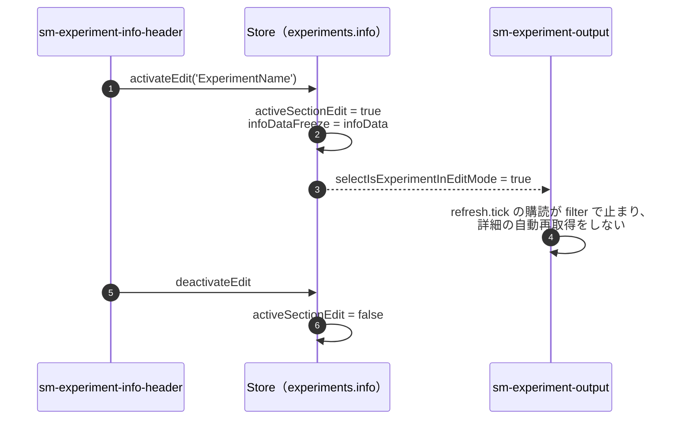

# 02 状態経路

実験名は Store の3か所に置かれている。書き換える Action と、読む画面部品がそれぞれ違う。

| 置き場所 | 書き換える Action | 読む側 |
| --- | --- | --- |
| `experiments.info.infoData` | `experimentDetailsUpdated`（dispatch 直後） `updateExperimentInfoData`（API 成功後） `setExperimentInfoData`（再取得後） | InfoHeader の `infoData()` → Inline の `originalText` |
| `experiments.info.selectedExperiment` | `updateExperimentInfoData`（API 成功後） `setExperiment`（再取得後） | Output の `selectedExperiment` Signal → InfoHeader の名前表示 |
| `experiments.view.experiments` | `updateExperiment`（API 成功後と再取得後の2回） | `selectExperimentsList` → EC → 一覧カード |

編集中フラグは `experiments.info.activeSectionEdit` にあり、`activateEdit` / `deactivateEdit` で切り替わる。

## 図1: Action と Store の流れ

- 一覧の `view.experiments` は、API が成功するまで旧名のまま。`experimentDetailsUpdated` を処理する Reducer は `info` 側にしかない。
- `updateExperiment` は `view.selectedExperiment` と `view.selectedExperiments` の該当要素も同じ変更で差し替える。

## 図2: Store から画面部品への流れ（Observable と Signal）

- Store から先は、コンポーネント境界ごとに Signal input で受け渡す。Observable のまま渡るのは EC と Output の中だけ。
- Inline 内部の状態は Store に置かない。`active`（編集モード）と `inlineValue`（入力値、`[(ngModel)]` と双方向）はどちらも Inline の WritableSignal。

## 編集中フラグの影響

## 読みどころ

- `infoData` の先行更新: [common-experiment-info.reducer.ts:86](../../src/app/webapp-common/experiments/reducers/common-experiment-info.reducer.ts#L86)
- `updateExperimentInfoData`: [common-experiment-info.reducer.ts:106](../../src/app/webapp-common/experiments/reducers/common-experiment-info.reducer.ts#L106)
- `activateEdit` / `deactivateEdit`: [common-experiment-info.reducer.ts:79](../../src/app/webapp-common/experiments/reducers/common-experiment-info.reducer.ts#L79)
- 一覧行の差し替え: [experiments-view.reducer.ts:109](../../src/app/webapp-common/experiments/reducers/experiments-view.reducer.ts#L109)
- `selectExperimentsList`: [reducers/index.ts:27](../../src/app/webapp-common/experiments/reducers/index.ts#L27)
- `experiments$`: [experiments.component.ts:207](../../src/app/webapp-common/experiments/experiments.component.ts#L207)
- `selectedExperiment` Signal の更新: [base-experiment-output.component.ts:140](../../src/app/webapp-common/experiments/containers/experiment-ouptut/base-experiment-output.component.ts#L140)
- 自動更新の停止条件: [base-experiment-output.component.ts:126](../../src/app/webapp-common/experiments/containers/experiment-ouptut/base-experiment-output.component.ts#L126)
