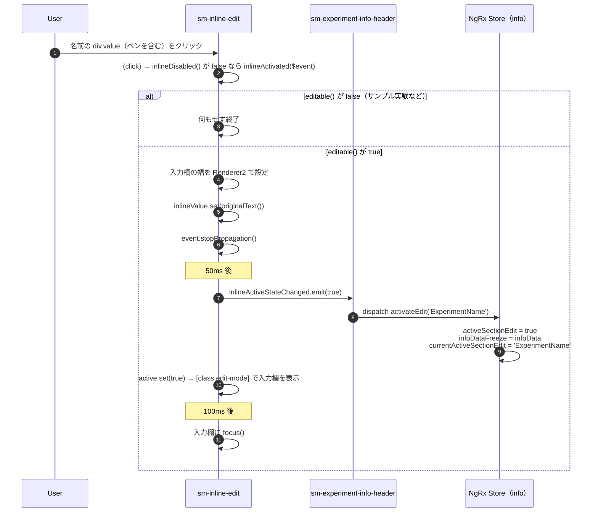

# 03-01 編集モードに入る

ヘッダーの実験名（またはペンアイコン）をクリックしてから、入力欄にフォーカスが入るまで。

## 図1: クリックから入力可能になるまで

- 入力欄の初期値は `originalText`（`infoData()?.name || experiment()?.name`）。直前の変更が `infoData` にだけ残っている場合は、その値が入る（[03-04](./03-04_保存されない分岐.md)）。
- `stopPropagation()` は、この click が `document` まで届かないようにする。Inline は host の `(document:click)` で編集を取り消すため（[03-03](./03-03_編集を取り消す.md)）。

## 状態の要点

- 編集モードかどうかは Inline の `active` Signal が持つ。Store の `activeSectionEdit` は、`inlineActiveStateChanged` を受けた InfoHeader の dispatch で合わせられる。
- `activeSectionEdit` が true の間、Output は詳細の自動再取得を止める（[02](./02_状態経路.md) 編集中フラグの影響）。

## 読みどころ

- クリックのバインド: [inline-edit.component.html:8](../../src/app/webapp-common/shared/ui-components/inputs/inline-edit/inline-edit.component.html#L8)
- `inlineActivated()`: [inline-edit.component.ts:103](../../src/app/webapp-common/shared/ui-components/inputs/inline-edit/inline-edit.component.ts#L103)
- `editExperimentName()`: [experiment-info-header.component.ts:148](../../src/app/webapp-common/experiments/dumb/experiment-info-header/experiment-info-header.component.ts#L148)
- `activateEdit` の Reducer: [common-experiment-info.reducer.ts:79](../../src/app/webapp-common/experiments/reducers/common-experiment-info.reducer.ts#L79)
