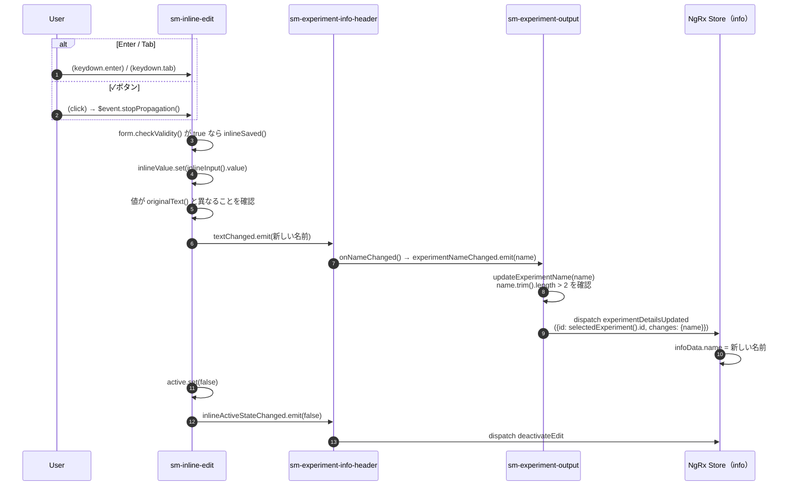
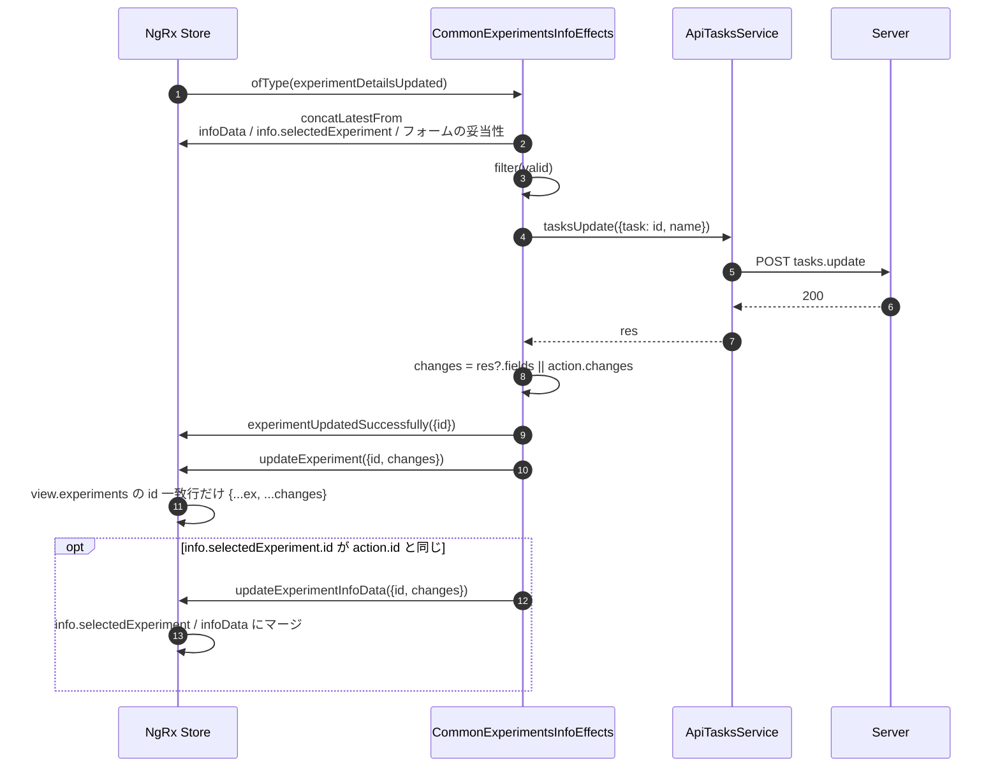
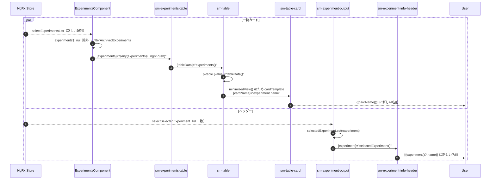
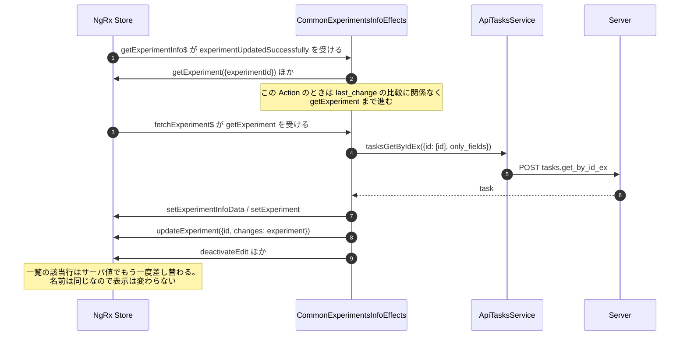

# 03-02 確定して一覧へ反映する

本線。入力を確定してから、一覧カードに新しい名前が描画されるまで。

## 図1: 確定から dispatch まで

- `textChanged.emit()` から dispatch と `infoData` の更新までは同期で進む。それが終わってから Inline が編集モードを閉じる。
- `trim()` は長さの確認にだけ使う。`changes.name` には前後の空白を含む入力値がそのまま入る。
- 値が変わっていない場合と、検証で止まる場合は [03-03](./03-03_編集を取り消す.md) / [03-04](./03-04_保存されない分岐.md)。

## 図2: API で保存し、Store を更新する

- `mergeMap` の中で `tasksUpdate` を呼ぶため、続けて別の名前を確定しても前のリクエストは取り消されない。
- `changes.tags` があれば `getTags` も出るが、名前の変更では出ない。

## 図3: 一覧カードとヘッダーの再描画

- 一覧は `tasks.get_all_ex` を呼び直さない。`updateExperiment` で差し替わった配列が Selector から流れるだけ。
- ヘッダーの名前表示は `info.selectedExperiment` を読むため、`updateExperimentInfoData` まで旧名のまま。

## 図4: 後続の再取得

## 読みどころ

- Enter のバインド: [inline-edit.component.html:36](../../src/app/webapp-common/shared/ui-components/inputs/inline-edit/inline-edit.component.html#L36)
- ✓ボタン: [inline-edit.component.html:54](../../src/app/webapp-common/shared/ui-components/inputs/inline-edit/inline-edit.component.html#L54)
- `inlineSaved()`: [inline-edit.component.ts:91](../../src/app/webapp-common/shared/ui-components/inputs/inline-edit/inline-edit.component.ts#L91)
- `onNameChanged()`: [experiment-info-header.component.ts:120](../../src/app/webapp-common/experiments/dumb/experiment-info-header/experiment-info-header.component.ts#L120)
- `updateExperimentName()`: [base-experiment-output.component.ts:177](../../src/app/webapp-common/experiments/containers/experiment-ouptut/base-experiment-output.component.ts#L177)
- `updateExperimentDetails$`: [common-experiments-info.effects.ts:450](../../src/app/webapp-common/experiments/effects/common-experiments-info.effects.ts#L450)
- `POST tasks.update`: [tasks.service.ts:2186](../../src/app/business-logic/api-services/tasks.service.ts#L2186)
- 一覧行の差し替え: [experiments-view.reducer.ts:161](../../src/app/webapp-common/experiments/reducers/experiments-view.reducer.ts#L161)
- カードの名前: [experiments-table.component.html:219](../../src/app/webapp-common/experiments/dumb/experiments-table/experiments-table.component.html#L219)
- `getExperimentInfo$`: [common-experiments-info.effects.ts:243](../../src/app/webapp-common/experiments/effects/common-experiments-info.effects.ts#L243)
- `fetchExperiment$`: [common-experiments-info.effects.ts:300](../../src/app/webapp-common/experiments/effects/common-experiments-info.effects.ts#L300)
