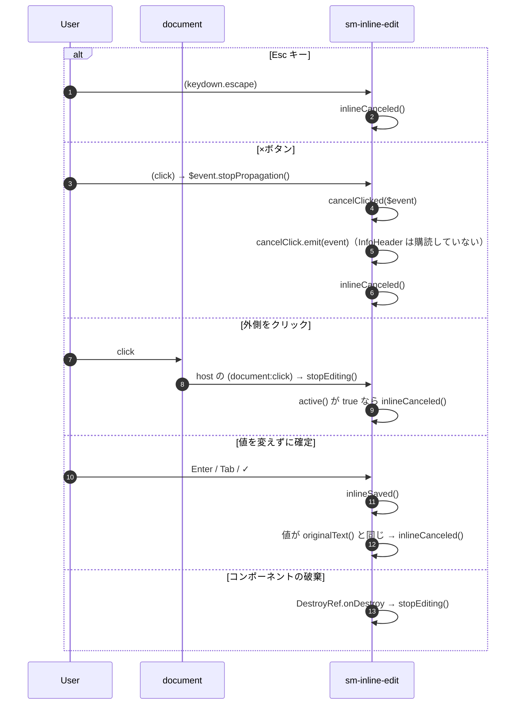
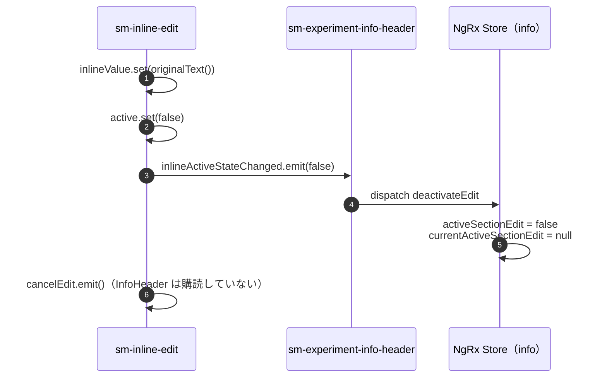

# 03-03 編集を取り消す

入力を保存せずに編集モードを閉じる操作。どの入口も最後は `inlineCanceled()` に集まり、API は呼ばない。

## 図1: 取り消しの入口

- Inline の内側をクリックしても取り消されない。一番外側の div が `(click)="active() && $event.stopPropagation()"` で、編集中のクリックを `document` へ届かせない。

## 図2: inlineCanceled() の中身

## 状態の要点

- 変わるのは Inline の `active` / `inlineValue` と、Store の編集中フラグだけ。`infoData` と一覧の `view.experiments` には触れない。
- `deactivateEdit` で `activeSectionEdit` が false に戻り、詳細の自動再取得が再開する。

## 読みどころ

- Esc / Enter / Tab のバインド: [inline-edit.component.html:34](../../src/app/webapp-common/shared/ui-components/inputs/inline-edit/inline-edit.component.html#L34)
- ×ボタン: [inline-edit.component.html:57](../../src/app/webapp-common/shared/ui-components/inputs/inline-edit/inline-edit.component.html#L57)
- 外側の div の click: [inline-edit.component.html:6](../../src/app/webapp-common/shared/ui-components/inputs/inline-edit/inline-edit.component.html#L6)
- host の `(document:click)`: [inline-edit.component.ts:26](../../src/app/webapp-common/shared/ui-components/inputs/inline-edit/inline-edit.component.ts#L26)
- `inlineCanceled()`: [inline-edit.component.ts:84](../../src/app/webapp-common/shared/ui-components/inputs/inline-edit/inline-edit.component.ts#L84)
- `deactivateEdit` の Reducer: [common-experiment-info.reducer.ts:85](../../src/app/webapp-common/experiments/reducers/common-experiment-info.reducer.ts#L85)
