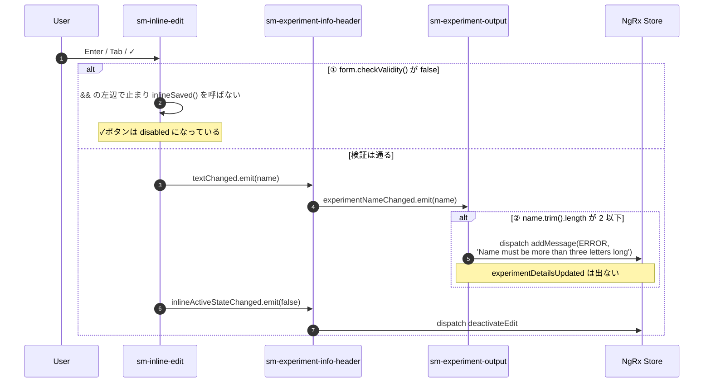
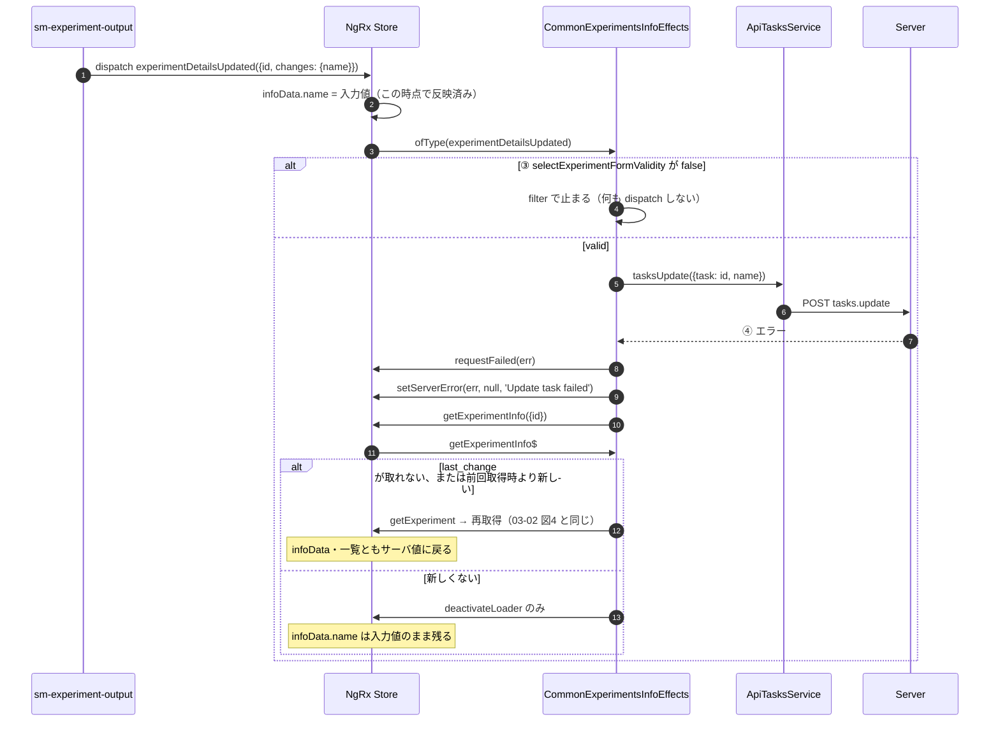

# 03-04 保存されない分岐

確定操作をしても一覧に新しい名前が出ない経路。止まる場所は4つある。

| 止まる場所 | 条件 | 編集モード | `infoData.name` | 一覧・ヘッダー表示 |
| --- | --- | --- | --- | --- |
| ① Inline | 入力欄の検証に通らない（空欄など） | 開いたまま | 旧名 | 旧名 |
| ② Output | 前後の空白を除いて2文字以下 | 閉じる | 旧名 | 旧名 |
| ③ InfoEff の filter | 詳細のフォームにエラーが残っている | 閉じる | **入力値** | 旧名 |
| ④ tasks.update 失敗 | API エラー | 閉じる | **入力値**（再取得されない場合） | 旧名 |

## 図1: ①② コンポーネントで止まる

- 下限が2段ある。Inline は `[minLength]="2"`、Output は `trim()` 後に3文字以上を求める。2文字の名前は Inline を通り、Output で止まる。
- ✓ボタンの disabled 条件は `trim()` 後の長さも見るが、Enter / Tab は `form.checkValidity()` しか見ない。前後に空白を足して長さを満たした名前は、Enter / Tab なら Inline を通り、② で止まる。
- ② のとき Inline は既に `textChanged` を出して編集モードを閉じている。入力し直すには再度クリックが必要。

## 図2: ③④ Effect で止まる

- ③ の条件は、`infoData` のキーのどれかに `info.errors` のエラーがあること。名前の入力とは別のセクションのエラーでも止まる。
- ③④ とも `updateExperiment` は出ないため、一覧の `view.experiments` は旧名のまま。
- ③④ で `infoData.name` だけが入力値になると、次に編集を始めたときの初期値（`originalText`）は入力値になる。ヘッダーの表示は `info.selectedExperiment` から来るので旧名のまま。

## 読みどころ

- Enter / Tab の検証: [inline-edit.component.html:34](../../src/app/webapp-common/shared/ui-components/inputs/inline-edit/inline-edit.component.html#L34)
- ✓ボタンの disabled 条件: [inline-edit.component.html:54](../../src/app/webapp-common/shared/ui-components/inputs/inline-edit/inline-edit.component.html#L54)
- 名前の長さ確認: [base-experiment-output.component.ts:178](../../src/app/webapp-common/experiments/containers/experiment-ouptut/base-experiment-output.component.ts#L178)
- `selectExperimentFormValidity`: [features/experiments/reducers/index.ts:57](../../src/app/features/experiments/reducers/index.ts#L57)
- filter: [common-experiments-info.effects.ts:457](../../src/app/webapp-common/experiments/effects/common-experiments-info.effects.ts#L457)
- catchError: [common-experiments-info.effects.ts:473](../../src/app/webapp-common/experiments/effects/common-experiments-info.effects.ts#L473)
- 再取得の判定: [common-experiments-info.effects.ts:272](../../src/app/webapp-common/experiments/effects/common-experiments-info.effects.ts#L272)
