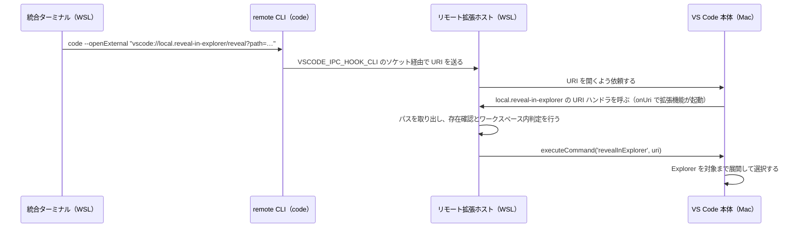

# reveal: ターミナルから VS Code の Explorer に表示する

`reveal <パス>` を統合ターミナルで実行すると、VS Code の Explorer が対象のファイルまたはフォルダまで展開し、その項目を選択する。エディタでは開かず、開いているワークスペースも変えない。

対象の環境は、Mac の VS Code から Remote-SSH で Windows 11 の WSL2（Ubuntu）に接続した構成である。

## 使い方

```bash
reveal                                          # カレントディレクトリ
reveal src/app/webapp-common/project-workloads  # 相対パス（フォルダ）
reveal src/app/app.config.ts                    # 相対パス（ファイル）
reveal {絶対パス}  # 絶対パス
```

- VS Code の統合ターミナル内で実行する。素の SSH セッションでは使えない（理由は「`code --open-url` では動かない理由」を参照）。
- 対象が存在しない場合とワークスペース外の場合は、Explorer を操作せず通知だけを出す。
- コマンドパレットの「Reveal in Explorer: パスを指定して Explorer に表示」からも同じ処理を実行できる。

## 構成要素と置き場所

| 要素 | 置き場所 | 役割 |
|---|---|---|
| シェル関数 `reveal()` | WSL の `~/.bashrc` | パスを絶対パスに直してパーセントエンコードし、URI として VS Code に渡す |
| 拡張機能 `local.reveal-in-explorer` | WSL の `~/.vscode-server/extensions/local.reveal-in-explorer-0.0.1/` | URI からパスを取り出し、存在を確認して Explorer に表示する |
| 拡張機能のソースとビルドスクリプト | WSL 上にはない | 拡張機能の README によると、`./build-and-install.sh` でビルドとインストールを行う |

拡張機能はリモート側（WSL）の拡張ホストで動く。対象の存在確認は、WSL のファイルシステムに対して行う必要があるためである。

## URI が拡張機能に届くまで



URI の authority（`local.reveal-in-explorer`）は、拡張機能の `package.json` の `publisher` と `name` を `.` でつないだ拡張機能 ID である。どちらかを変えたら、シェル関数の URI も変える必要がある。

## `code --open-url` では動かない理由

Remote-SSH の接続先の統合ターミナルで使える `code` は、VS Code Server に同梱された remote CLI である。remote CLI はデスクトップ版の CLI と違い、Mac 側へ転送するオプションを許可リストで絞っている。`--open-url` はこの許可リストに含まれない。

そのため `code --open-url "vscode://…"` を実行すると、次の順に処理され、拡張機能は呼ばれない。

1. `Ignoring option 'open-url': not supported for code.` を表示して、オプションを捨てる
2. 残った `vscode://…` を通常の引数として、カレントディレクトリ基準のファイルパスとみなす
3. そのパスは存在しないので新規ファイルとして開こうとし、新しいウィンドウが開く

代わりに使う `--openExternal` は remote CLI にだけあるオプションで、環境変数 `VSCODE_IPC_HOOK_CLI` が設定されているときに限り有効になる。この変数は統合ターミナルなど VS Code から起動したプロセスにしか設定されないので、素の SSH セッションからは `reveal` を使えない。

## シェル関数の実装

`~/.bashrc` に定義している。

```bash
reveal() {
  local target="${1:-.}"
  local abs dir base enc uri
  if [ -d "$target" ]; then
    abs=$(cd "$target" >/dev/null 2>&1 && pwd) || { printf 'reveal: パスを解決できません: %s\n' "$target" >&2; return 1; }
  else
    dir=$(dirname -- "$target")
    base=$(basename -- "$target")
    dir=$(cd "$dir" >/dev/null 2>&1 && pwd) || { printf 'reveal: パスを解決できません: %s\n' "$target" >&2; return 1; }
    abs="${dir%/}/$base"
  fi
  enc=$(perl -e '$s=$ARGV[0]; $s =~ s{([^A-Za-z0-9\-\._~/:])}{sprintf("%%%02X", ord($1))}ge; print $s;' "$abs") || return 1
  uri="vscode://local.reveal-in-explorer/reveal?path=$enc"
  if [ "$(uname)" = Darwin ]; then
    open "$uri"                     # Mac: LaunchServices 経由
  elif [ -n "$VSCODE_IPC_HOOK_CLI" ]; then
    code --openExternal "$uri"      # Remote: remote CLI は --open-url 非対応。--openExternal で Mac 側の VS Code に URI を渡す
  else
    printf 'reveal: VS Code の統合ターミナル内で実行してください\n' >&2
    return 1
  fi
}
```

- 絶対パスへの変換は、ディレクトリなら `cd` してから `pwd`、ファイルなら親ディレクトリで同じことをしてからファイル名をつなげて行う。
- 対象ファイルが存在しなくても、親ディレクトリが存在すればそのまま URI を送る。実在の確認は拡張機能側で行う。親ディレクトリも存在しない場合は、シェル関数が「パスを解決できません」を出して終わる。
- パーセントエンコードは perl でバイト単位に行う。日本語を含むパスも、UTF-8 のバイト列としてエンコードされる。
- URI の開き方は OS と `VSCODE_IPC_HOOK_CLI` で分ける。Mac では `open` を使い、Remote では `code --openExternal` を使う。

## 拡張機能の処理

`extension.js` は URI を受け取ると、次の順に処理する。

1. URI のパスが `/reveal` であることを確認し、クエリの `path=` 以降を対象パスとして取り出す。`vscode.Uri` のクエリはデコード済みなので、再デコードはしない。`path=` から末尾までを取るので、`&` を含むパスも扱える。
2. 相対パスと `~` で始まるパスを、絶対パスに直す。相対パスはワークスペースの最初のフォルダを基準にする。シェル関数は常に絶対パスを送るので、URI を直接開いた場合のための処理である。
3. `vscode.workspace.fs.stat` で存在を確認する。存在しなければエラーを通知して終わる。
4. `vscode.workspace.getWorkspaceFolder` でワークスペース内かどうかを判定する。ワークスペース外なら警告を通知して終わる。
5. 内部コマンド `revealInExplorer` に URI を渡す。

`revealInExplorer` は公開 API ではない内部コマンドなので、VS Code の更新で変更・削除される可能性がある。依存箇所は、定数 `REVEAL_COMMAND_ID` と関数 `revealInExplorer()` に限定してある。実行前に `vscode.commands.getCommands(true)` でコマンドの存在を確認し、なくなっていればエラーを通知する。

## 動作確認の方法

拡張機能のログは、出力パネルの「Reveal in Explorer」で見られる。WSL 上のファイルとしては次の場所にある。

```
~/.vscode-server/data/logs/<起動時刻>/exthost<N>/output_logging_<時刻>/<N>-Reveal in Explorer.log
```

URI が届くと、`activated`（拡張機能の起動時のみ）、`handleUri …`、`reveal directory …` または `reveal file …` の順に記録される。ログファイル自体がなければ、拡張機能は一度も起動しておらず、URI が届いていない。

2026-09-21 時点の確認結果は次のとおり。

| ケース | 結果 |
|---|---|
| 相対パスでフォルダを指定（`reveal ./src/app/webapp-common/project-workloads`） | 確認済み（ログと画面） |
| 相対パスでファイルを指定 | 未確認 |
| 絶対パスを指定 | 未確認 |
| 存在しないパスを指定 | 未確認 |
| ワークスペース外のパスを指定 | 未確認 |
| Mac のターミナルから実行 | 未確認 |

## 制約

- ワークスペース外のパスは Explorer に表示できない。Explorer はワークスペースのツリーしか展開できず、ワークスペースは変えない方針なので、警告だけを出す。
- `files.exclude` や `explorer.excludeGitIgnore` で Explorer から隠れている対象は、`revealInExplorer` を実行しても選択されない可能性がある（未確認）。拡張機能はこのケースを検知しない。
- 複数のウィンドウを開いている場合、URI を受け取るウィンドウは Mac 側の VS Code が決める。実行直後はコマンドを打ったウィンドウがアクティブなので、通常はそのウィンドウに届く。
- Mac のターミナルから使う場合は、WSL の絶対パスを渡す必要がある。相対パスは Mac 上のパスとして絶対パス化され、WSL 上には存在しないためである。

## 残課題

- 拡張機能の `package.json` に `"extensionKind": ["workspace"]` を明示していない。現在は、`main` を持つ拡張機能の既定値によってリモート側で動いている。
- 拡張機能の README の構成図が、`code --open-url` のままになっている。
- `.bashrc` のコメントにあるソースの場所（`~/work/x-aitool/vscode-reveal-in-explorer`）は、WSL 上に存在しない。
- Mac の `~/.zshrc` にある `reveal()` の中身は確認していない（拡張機能の README では定義済みとされている）。
